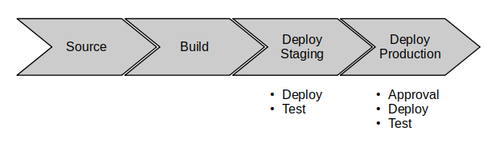
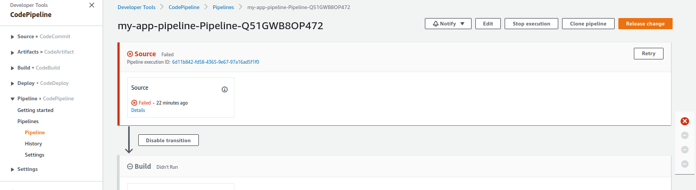
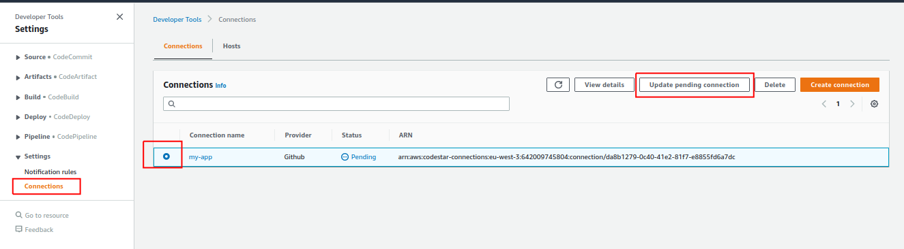
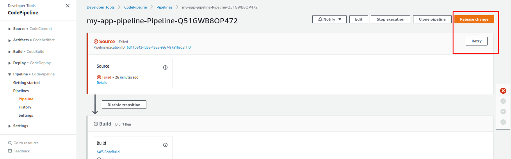
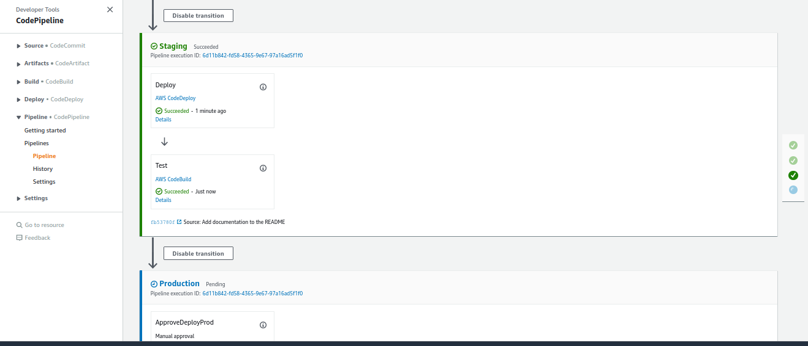
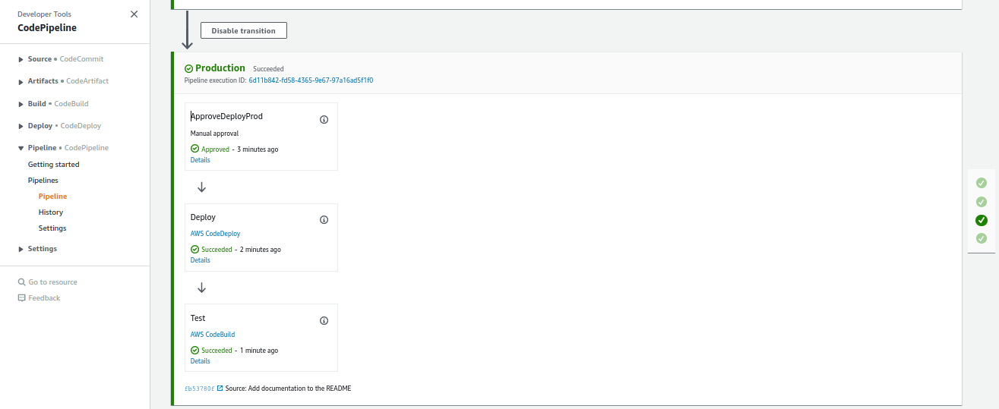

# CodeBuild test report demo

:fr: Sommaire / :gb: Table of Contents
=================

<!--ts-->

- [:fr: Description du projet](#fr-description-du-projet)
  * [Pré-requis](#pré-requis)
  * [Lancement du projet](#lancement-du-projet)
- [:gb: Project Description](#gb-project-description)
  * [Pre-requisites](#pre-requisites)
  * [Launching the project](#launching-the-project)  
  
---

# :fr: Description du projet

Ce repo est accompagné d'une série d'articles (en cours d'écriture):
- [https://joseph-mbimbi.fr/blog/codebuild-test-report-demo-part-1](https://joseph-mbimbi.fr/blog/codebuild-test-report-demo-part-1)
- [https://joseph-mbimbi.fr/blog/codebuild-test-report-demo-part-2](https://joseph-mbimbi.fr/blog/codebuild-test-report-demo-part-2)

Le but de ce projet et de servir de démo et de support pour l'intégration de rapport de tests à une pipeline de cicd dans AWS Developer Tools (CodeBuild, CodeDeploy, CodePipeline, etc.) pour une application java backend basique.

Les types de tests que nous couvrirons seront:
- tests lors du build de l'application
  - tests unitaires: `mvn test` 
  - tests "d'intégration": `mvn verify`
- tests sur l'application déployée dans un environnement, instance-s EC2 pour notre démo
  - des tests en Java / Cucumber, déclenchés via `Maven`
  
Voici la pipeline déployée:

## Pré-requis

- un compte AWS
- AWS CLI
- un compte github
- make
- Packer
- un paire de clés ssh

## Lancement du projet

0. Forker le projet
1. Adapter les variables dans `infra/infra.env`
  - 1.1 `GITHUB_REPO`: remplacer "mbimbij" par votre username github
  - 1.2 `SSH_KEY_NAME`: le nom de la paire de clés ssh dans AWS pour se connecter à la machine de rebond
  - 1.3 `SSH_KEY_PATH`: le chemin vers la clé ssh publique à uploader dans AWS
2. se déplacer dans `infra` et lancer la commande `make all APPLICATION_NAME=my-app` (mettez le nom que vous voulez pour l'application) pour lancer la création des différentes stacks `CloudFormation`
3. Au bout d'un certain moment (10-15 minutes), la pipeline devrait être créée, mais le status de déploiement devrait être en échec car la connexion github n'est pas activée
  - Il n'est pas possible d'activer une connexion github "PENDING" via `CloudFormation` ou AWS CLI : [https://docs.aws.amazon.com/dtconsole/latest/userguide/connections-update.html](https://docs.aws.amazon.com/dtconsole/latest/userguide/connections-update.html)

4. Activez la connexion github

5. Relancez la pipeline via "Retry" ou "Release Change"

6. Vous devriez avoir une pipeline verte jusqu'en Staging

7. Approuvez, et la pipeline devrait être verte en Prod

8. Quand vous aurez fini, supprimez toutes les ressources crées en lançant la command `make delete-all APPLICATION_NAME=my-app` dans le répertoire `infra`

---

# :gb: Project Description

This repo comes with a series of blog articles (work in progress)
- [https://joseph-mbimbi.fr/blog/codebuild-test-report-demo-part-1](https://joseph-mbimbi.fr/blog/codebuild-test-report-demo-part-1)

The goal of this project is to demonstrate and be used as a future reference for integrating test reports to a cicd pipeline using AWS Developer Tools (CodeBuild, CodeDeploy, CodePipeline, etc.) for a basic java backend application.

The types of tests we will cover are:
- "build time" tests
  - unit tests: `mvn test`
  - so-called "integration tests": `mvn verify`
- tests on the application being deployed in an environment, EC2 instances in that case
  - Java / Cucumber tests, launched with `Maven`

Here is pipeline that will be deployed:

## Pre-requisites

- an AWS account
- AWS CLI
- a github account
- make
- Packer
- an SSH key pair

## Launching the project

0. Fork the project
1. Modify the variable in `infra/infra.env`
- 1.1 `GITHUB_REPO`: replace "mbimbij" with your github username
- 1.2 `SSH_KEY_NAME`: the name of the key pair to be create in AWS to connect to the bastion host
- 1.3 `SSH_KEY_PATH`: the local path to your ssh public key
2. go to `infra` directory and run the command `make all APPLICATION_NAME=my-app` (put whatever name for the application) to start the creation of the different `CloudFormation` stacks
3. After about 10-15 minutes, the pipeline should be create, but the deployment should fail because github connection created through `CloudFormation` or the CLI are created in a "PENDING" state
  - You must use the web console to activate a "PENDING" github connection, it is not possible otherwise : [https://docs.aws.amazon.com/dtconsole/latest/userguide/connections-update.html](https://docs.aws.amazon.com/dtconsole/latest/userguide/connections-update.html)

4. Activate the github connection

5. Restart the pipeline by clicking on "Retry" or "Release Change"

6. You should have a green pipeline up to "Staging"

7. Approve the deployment to Production, and the pipeline should be all green

8. When you are done, tear down all stacks and resources by running the command `make delete-all APPLICATION_NAME=my-app` in the directory `infra`