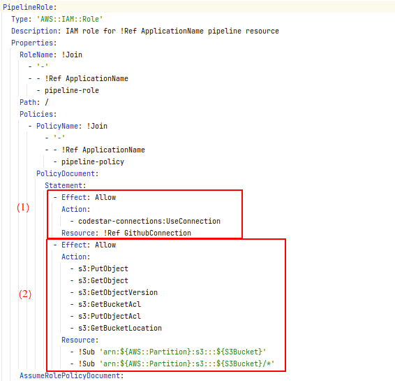
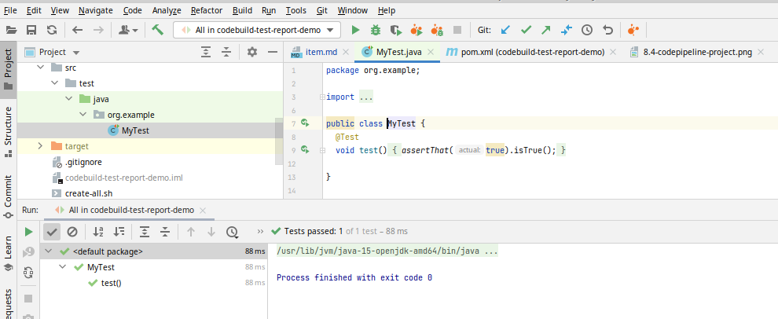

---
title: Pipeline CI/CD d'une application Java dans EC2 - partie 1
date: 15:30 05/21/2021
author: Joseph M'Bimbi-Bene
hero_classes: 'text-light overlay-dark-gradient'
hero_image: codebuild.png
taxonomy:
category: blog
tag: [devops, cloud, tests]
---

Dans cette article, nous allons développer une pipeline de CI pour une application Java, et publier des rapports de test et de couverture de test dans `CodeBuild`.

===


### Sommaire

- [Introduction, Description du projet](#introduction-description-du-projet)
  * [Cible](#cible)
  * [Etapes](#etapes)
  * [Plan de l'article](#plan-article)
- [Implémentation avec `CloudFormation`](#implementation-cloudformation)
  * [1. Mise en place d'un Bucket S3 pour la pipeline de CI/CD](#1.2-s3-bucket)
  * [2. Mise en place d'une connexion Github](#1.3-github-connection)
  * [3. Mise en place d'un rôle IAM pour CodeBuild](#1.4-codebuild-iam-role)
  * [4. Mise en place d'un rôle IAM pour CodePipeline](#1.5-codepipeline-iam-role)
  * [5. Mise en place d'un projet CodeBuild](#1.6-codebuild-project)
  * [6. Mise en place d'un projet CodePipeline](#1.7-codepipeline-project)
  * [7. Mise en place d'un projet Java avec éxécution d'un test unitaire "build time" en Junit - local](#1.8-buildtime-test-junit-execution-local)
  * [8. Mise en place de la couverture de test avec Jacoco - local](#1.9-buildtime-test-junit-reporting-local)
  * [9. Reporting de l'éxécution des des tests unitaires "build time" en Junit et de la couverture de tests dans la pipeline](#1.10-buildtime-test-junit-reporting-pipeline)
  * [10. Ajout de tests unitaires (`mvn test`) en Cucumber dans la pipeline](#1.11-buildtime-unit-test-cucumber)
  * [11. Ajout de tests d'intégration "build time" (`mvn verify`) en Junit](#1.12-buildtime-integation-test-junit)
  * [12. Ajout de tests d'intégration "build time" (`mvn verify`) en Cucumber](#1.13-buildtime-integation-test-cucumber)
- [Références](#references)

<small><i><a href='http://ecotrust-canada.github.io/markdown-toc/'>Table of contents generated with markdown-toc</a></i></small>


###  <a name="introduction-description-du-projet"></a> Introduction, Description du projet

Cette article est le 1e d'une série. Voir aussi:
- [partie 2](https://joseph-mbimbi.fr/blog/codebuild-test-report-demo-part-2)

Dans cette série d'articles, nous allons développer une application Java backend très simple, typiquement composée uniquement d'une classe renvoyant une `String` en dur.

Cette application sera accompagnée d'une pipeline de CI/CD avec éxécution de tests unitaires et de tests automatisés, éxécutés sur l'application déployée sur une ou plusieurs instances EC2.
Les rapports d'éxécution et de couverture des tests seront publiés dans `CodeBuild`

Le but est d'avoir un point de départ réutilisable, fournissant un exemple simple, permettant de réimplémenter cette logique de pipeline et de publication de rapports de tests sur des projets plus compliqués.

#### <a name="cible"></a> Cible

Le but de la série d'articles est d'avoir au final:
- une application Java de base
- une pipeline de CI/CD déployant l'application dans plusieurs instances EC2 derrière un Load Balancer
- des tests unitaires et "d'intégration" (`mvn verify`) sont éxécutés lors de la phase de `Build` de la pipeline
- des tests automatisés sont éxécutés sur l'application après son déploiement dans un environnement de test
- un rapport sur le résultats des "tests unitaires" (`mvn verify`) est publié
- un rapport sur la couverture des "tests unitaires" (`mvn verify`) est publié
- un rapport sur l'éxécution de tests automatisés sur l'environnement de test est publié

#### <a name="etapes"></a> Etapes

Nous allons réaliser la cible par les étapes suivantes:
1. Mise en place d'une pipeline de "Build" de l'application (pas encore de déploiement), avec éxécuton des tests unitaires et publication des rapports de test
2. Déploiement de l'application dans une instance EC2, avec éxécution de test sur cet instance et publication d'un rapport de test
3. Déploiement dans plusieurs instances derrière un Load Balancer, avec éxécution de tests au niveau du Load Balancer et publication de rapport de tests


#### <a name="plan-article"></a> Plan de l'article

Dans cet article, nous allons réaliser l'étape n°1, à savoir:

- Mise en place d'une pipeline de "Build" de l'application (pas encore de déploiement)
- éxécution de tests unitaires et "d'intégration" (`mvn verify`), avec Junit et Cucumber
- publication des rapports d'éxécution et de couverture des tests


### <a name="implementation-cloudformation"></a> Implémentation avec `CloudFormation`

#### <a name="1.2-s3-bucket"></a> 1. Mise en place d'un Bucket S3 pour la pipeline de CI/CD

tag de départ: `1.1-initial-commit`
tag d'arrivée: `1.2-s3-bucket`

Nous créons un bucket S3 avec le template `CloudFormation` suivant:

```yaml
Parameters:
  ApplicationName:
    Type: String
    Description: Application Name

Resources:
  S3Bucket:
    Type: 'AWS::S3::Bucket'
    Description: S3 bucket for pipeline artifacts
    Properties:
      BucketName: !Join
        - '-'
        - - !Ref 'AWS::Region'
          - !Ref 'AWS::AccountId'
          - !Ref ApplicationName
          - bucket-pipeline
```

Nous créons aussi les 2 scripts suivants pour nous faciliter le travail d'installation et de destruction de l'infra:
- `create-all.sh`
- `delete-all.sh`

Nous pouvons créer le bucket S3 via la commande suivante:
```shell
./create-all.sh my-app
```

Vérifions la bonne éxécution création du bucket de la stack `CloudFormation`:


Vérifions la création du bucket S3:


#### <a name="1.3-github-connection"></a> 2. Mise en place d'une connexion Github
tag de départ: `1.2-s3-bucket`
tag d'arrivée: `1.3-github-connection`

Nous rajoutons la ressource `CloudFormation` suivante pour créer la connexion `Github`:

```yaml
GithubConnection:
  Type: AWS::CodeStarConnections::Connection
  Properties:
    ConnectionName: !Ref ApplicationName
    ProviderType: GitHub
```

updatons la stack `CloudFormation` via le script helper:
```shell
./create-all.sh my-app
```

On vérifie la bonne éxécution de l'update de la stack:


Et la présence de la connexion Github:


Les connexion github créées par `CloudFormation` ou la CLI AWS sont toujours pending et doivent être activées à la main.
Pour autant que l'auteur le sache, il n'y a pas de moyen d'activer automatiquement une connexion (sauf bricolage avec quelque chose comme Sélénium éventuellement).
Voir [https://docs.aws.amazon.com/dtconsole/latest/userguide/connections-update.html](https://docs.aws.amazon.com/dtconsole/latest/userguide/connections-update.html)

    A connection created through [...] AWS CloudFormation is in PENDING status by default [...]
    You **must** use the console to update a pending connection. You cannot update a pending connection using the AWS CLI.

#### <a name="1.4-codebuild-iam-role"></a> 3. Mise en place d'un rôle IAM pour CodeBuild
tag de départ: `1.3-github-connection`
tag d'arrivée: `1.4-codebuild-iam-role`

Dans cette étape, nous créons un rôle qui sera endossé par le futur projet `CodeBuild`, ainsi que les permissions associées.
Ce qui se traduit par la ressource `CloudFormation` suivante:

```yaml
BuildProjectRole:
  Type: 'AWS::IAM::Role'
  Description: IAM role for !Ref ApplicationName build resource
  Properties:
    RoleName: !Join
      - '-'
      - - !Ref ApplicationName
        - build-role
    Path: /
    Policies:
      - PolicyName: !Join
          - '-'
          - - !Ref ApplicationName
            - build-policy
        PolicyDocument:
          Statement:
            - Effect: Allow
              Action:
                - s3:PutObject
                - s3:GetObject
                - s3:GetObjectVersion
                - s3:GetBucketAcl
                - s3:GetBucketLocation
              Resource:
                - !Sub 'arn:${AWS::Partition}:s3:::${S3Bucket}'
                - !Sub 'arn:${AWS::Partition}:s3:::${S3Bucket}/*'
            - Effect: Allow
              Action:
                - logs:CreateLogGroup
                - logs:CreateLogStream
                - logs:PutLogEvents
              Resource: !Sub 'arn:${AWS::Partition}:logs:${AWS::Region}:${AWS::AccountId}:log-group:/aws/codebuild/*'
            - Effect: Allow
              Action:
                - codebuild:CreateReportGroup
                - codebuild:CreateReport
                - codebuild:UpdateReport
                - codebuild:BatchPutTestCases
                - codebuild:BatchPutCodeCoverages
              Resource: !Sub 'arn:${AWS::Partition}:codebuild:${AWS::Region}:${AWS::AccountId}:report-group/${ApplicationName}-*'
    AssumeRolePolicyDocument:
      Statement:
        - Action: "sts:AssumeRole"
          Effect: Allow
          Principal:
            Service:
              - codebuild.amazonaws.com
```

Analysons un peu ce que l'on vient de rajouter:
Nous avons donc créé un "rôle", l'équivalent AWS d'une "carte d'accès", qui définit: 
- quels sont les permission liés à ce rôle (la carte donne accès à quoi ?)
- quels services peut "assumer" le rôle (qui a le droit de porter cette carte ?)

Voyons ce que cela donne dans notre rôle:


1. Nous donnons au rôle le droit d'effectuer la liste d'opération définie dans `Action`, pour le bucket S3 que l'on a créé précédemment
2. Nous donnons au rôle le droit de créer des logs auprès d'un service nommé `CloudWatch logs`. On note que sans ces droits, le projet `CodeBuild` ne pourra pas s'éxécuter


3. Nous donnons au rôle le droit de publier des rapports de tests, puisque c'est le but principal de ce projet pour commencer
4. Nous définissons qui a le droit d'assumer le rôle, ici les projets de type `CodeBuild`

updatons la stack `CloudFormation` via le script helper:
```shell
./create-all.sh my-app
```

On vérifie la bonne éxécution de la mise à jour de la stack, ainsi que la création de la nouvelle ressource:


On vérifie rapidement les permissions sur le rôle nouvellement créé:


#### <a name="1.5-codepipeline-iam-role"></a> 4. Mise en place d'un rôle IAM pour CodePipeline
tag de départ: `1.4-codebuild-iam-role`
tag d'arrivée: `1.5-codepipeline-iam-role`

Dans cette étape, nous créons un rôle qui sera endossé par le futur projet `CodePipeline`, ainsi que les permissions associées.
Ce qui se traduit par la ressource `CloudFormation` suivante:

```yaml
PipelineRole:
  Type: 'AWS::IAM::Role'
  Description: IAM role for !Ref ApplicationName pipeline resource
  Properties:
    RoleName: !Join
      - '-'
      - - !Ref ApplicationName
        - pipeline-role
    Path: /
    Policies:
      - PolicyName: !Join
          - '-'
          - - !Ref ApplicationName
            - pipeline-policy
        PolicyDocument:
          Statement:
            - Effect: Allow
              Action:
                - codestar-connections:UseConnection
              Resource: !Ref GithubConnection
            - Effect: Allow
              Action:
                - s3:PutObject
                - s3:GetObject
                - s3:GetObjectVersion
                - s3:GetBucketAcl
                - s3:PutObjectAcl
                - s3:GetBucketLocation
              Resource:
                - !Sub 'arn:${AWS::Partition}:s3:::${S3Bucket}'
                - !Sub 'arn:${AWS::Partition}:s3:::${S3Bucket}/*'
    AssumeRolePolicyDocument:
      Statement:
        - Action: "sts:AssumeRole"
          Effect: Allow
          Principal:
            Service:
              - codepipeline.amazonaws.com
```

Ici aussi, analysons le rôle créé:


1. Nous donnons au rôle la permission d'utiliser la connexion `Github` définie dans l'étape #2
2. Nous donnons au rôle la permission de lire et écrire vers le bucket S3 défini dans l'étape #1, la pipeline *utilise* la connexion `Github`, mais c'est elle-même qui va récupérer le code source et le pousser dans le bucket s3, il n'y a pas de délégation de l'action vers un autre service


3. Nous définissons qui a le droit d'assumer le rôle, ici les services de type `CodePipeline`

updatons la stack `CloudFormation` via le script helper:
```shell
./create-all.sh my-app
```

On vérifie la bonne éxécution de la mise à jour de la stack, ainsi que la création de la nouvelle ressource:


On jette un oeil au rôle IAM créé et aux policies qui lui sont attachées:


#### <a name="1.6-codebuild-project"></a> 5. Mise en place d'un projet CodeBuild
tag de départ: `1.5-codepipeline-iam-role`
tag d'arrivée: `1.6-codebuild-project`

Dans cette partie, nous allons rajouter un projet `CodeBuild`, qui sera déclenché par `CodePipeline`.

Nous commençons par le projet `CodeBuild` car un projet `CodePipeline` doit avoir au minimum 2 "stages", qui seront dans notre cas : "Source", "Build".
Le stage "Source" a deja été anticipé par la création de la connexion `Github`, maintenant on s'occupe d'anticiper le stage "Build".

Voici les mises à jour qui sont effectuées dans le template `CloudFormation`:

```yaml
Parameters:
  [...]
  GithubRepo:
    Type: String
    Description: Github source code repository
  GithubRepoBranch:
    Default: 'main'
    Type: String
    Description: Github source code branch

Resources:
  [...]
  PipelineRole:
    Properties:
      Policies:
          PolicyDocument:
            Statement:
              [...]
              - Effect: Allow
                Action:
                  - codebuild:BatchGetBuilds
                  - codebuild:StartBuild
                  - codebuild:BatchGetBuildBatches
                  - codebuild:StartBuildBatch
                Resource: !GetAtt
                  - BuildProject
                  - Arn
  [...]
  BuildProject:
    Type: AWS::CodeBuild::Project
    Properties:
      Name: !Join
        - '-'
        - - !Ref ApplicationName
          - build-project
      Description: A build project for !Ref ApplicationName
      ServiceRole: !Ref BuildProjectRole
      Artifacts:
        Type: CODEPIPELINE
        Packaging: ZIP
      Environment:
        Type: LINUX_CONTAINER
        ComputeType: BUILD_GENERAL1_SMALL
        Image: aws/codebuild/amazonlinux2-x86_64-standard:3.0
      Source:
        Type: CODEPIPELINE
        BuildSpec: |
          version: 0.2
          phases:
            build:
              commands:
                - echo "hello world"

```

Nous rajoutons:
- 2 paramètres:
  - `GithubRepo`: le nom du repo `Github
  - `GithubRepoBranch`: la branche à récupérer, par défaut: `main`
- un projet `CodeBuild`
- la permission au rôle `CodePipeline` de déclencher le projet `CodeBuild` défini just après

On aurait pu définir les paramètres et l'extension des permissions du projet `CodePipeline` lors d'un futur commit, mais bon, ce qui est fait est fait, ça sera pour un futur article encore plus clean.

updatons la stack `CloudFormation` via le script helper:
```shell
./create-all.sh my-app
```

On vérifie la bonne éxécution de la mise à jour de la stack, ainsi que la création de la nouvelle ressource:


On jette un oeil aux projets CodeBuild pour vérifier la création du projet:


On fait confiance à `CloudFormation` pour avoir mis à jour les permission IAM sur le rôle dédié à `CodePipeline`.

Pour le sport, on peut vérifier l'apparition des 2 nouvelles properties:


#### <a name="1.7-codepipeline-project"></a> 6. Mise en place d'un projet CodePipeline
tag de départ: `1.6-codebuild-project`
tag d'arrivée: `1.7-codepipeline-project`

Dans cette partie, nous allons rajouter un projet `CodePipeline`, qui sera composé de 2 stages:
- "Source", pour récupérer le code source depuis le repo `Github`
- "Build", qui va builder le projet java. Pour cette étape cependant, nous allons juste afficher "hello world" dans la console, pour vérifier le déclenchement du projet `CodeBuild` par `CodePipeline`

Ce qui se traduit par l'ajout de la ressource `CloudFormation` suivante:

```yaml
Pipeline:
  Description: Creating a deployment pipeline for !Ref ApplicationName project in AWS CodePipeline
  Type: 'AWS::CodePipeline::Pipeline'
  Properties:
    RoleArn: !GetAtt
      - PipelineRole
      - Arn
    ArtifactStore:
      Type: S3
      Location: !Ref S3Bucket
    Stages:
      - Name: Source
        Actions:
          - Name: Source
            ActionTypeId:
              Category: Source
              Owner: AWS
              Version: 1
              Provider: CodeStarSourceConnection
            OutputArtifacts:
              - Name: SourceOutput
            Configuration:
              ConnectionArn: !Ref GithubConnection
              FullRepositoryId: !Ref GithubRepo
              BranchName: !Ref GithubRepoBranch
              OutputArtifactFormat: "CODE_ZIP"
      - Name: Build
        Actions:
          - Name: Build
            InputArtifacts:
              - Name: SourceOutput
            OutputArtifacts:
              - Name: BuildOutput
            ActionTypeId:
              Category: Build
              Owner: AWS
              Version: 1
              Provider: CodeBuild
            Configuration:
              ProjectName:
                Ref: BuildProject
```

Voir [https://docs.aws.amazon.com/AWSCloudFormation/latest/UserGuide/aws-resource-codepipeline-pipeline.html](https://docs.aws.amazon.com/AWSCloudFormation/latest/UserGuide/aws-resource-codepipeline-pipeline.html) pour la documentation

Analysons un peu cette ressource:


1. Le projet `CodePipeline` s'éxécutera avec le rôle définit dans l'étape #4
2. Les artefacts générés par la pipeline seront stockés dans le bucket S3 défini dans l'étape #1
3. Stage "Source"
  - 3.1 Le stage "Source" est composé d'une seule Action, de catégorie "Source", dont le provider est `CodeStarSourceConnection`. 
    - Voir [https://docs.aws.amazon.com/codepipeline/latest/userguide/reference-pipeline-structure.html#actions-valid-providers](https://docs.aws.amazon.com/codepipeline/latest/userguide/reference-pipeline-structure.html#actions-valid-providers) pour la liste des types d'action valides, et les différents provider pour chaque type
  - 3.2 On donne le nom "SourceOutput" pour la sortie de l'action associé au stage "Source". Cela définira le nom d'un dossier dans le bucket S3 associé à la pipeline
- 3.3 La configuration de l'action de type `CodeStarSourceConnection`
    - Voir [https://docs.aws.amazon.com/codepipeline/latest/userguide/action-reference-CodestarConnectionSource.html](https://docs.aws.amazon.com/codepipeline/latest/userguide/action-reference-CodestarConnectionSource.html) pour la référence de la configuration pour les actions de type `CodeStarSourceConnection`


4. Stage "Build"
  - 4.1 L'action de build prend en entrée "SourceOutput"
  - 4.2 L'action de build a pour sortie "BuildOutput"
  - 4.3 L'action est de catégorie "Build" et a pour provider `CodeBuild`. Dans la configuration, on référence le projet `CodeBuild` créé dans l'étape #5

updatons la stack `CloudFormation` via le script helper:
```shell
./create-all.sh my-app
```

On vérifie la bonne éxécution de la mise à jour de la stack, ainsi que la création de la nouvelle ressource:


On vérifie la création et le statut de la pipeline dans "Developer Tools":


Si le statut est en échec, cela peut venir du fait que la connexion github n'est pas activée.
Nous l'avons fait lors de l'étape #2, mais si jamais vous avez par exemple, supprimé et recréé la stack `CloudFormation` de la pipeline vous devrez activer à nouveau la connexion et relancer une release dans la pipeline:


La pipeline devrait alors s'être éxécutée avec succès:


Allons inspecter le résultat du build


Vérifions la console:


Nous avons bien pu logger "Hello World". Allons inspecter enfin le code source dans le bucket S3:


On note les répertoires créés par `CodePipeline` et le lien avec les configurations  "InputArtifacts" et "OutputArtifacts" du template `CloudFormation` de notre pipeline.

Téléchargeons le zip et inspectons son contenu:


Le contenu du zip est bien le code source du projet. Félicitations, nous avons désormais une base réutilisable et assez générique, pour bootstrapper une pipeline de CI/CD.

#### <a name="1.8-buildtime-test-junit-execution-local"></a> 7. Mise en place d'un projet Java avec éxécution d'un test unitaire "build time" en Junit - local
tag de départ: `1.7-codepipeline-project`
tag d'arrivée: `1.8-buildtime-test-junit-execution-local`

Dans cette étape, nous créons un projet `Java` minimal, avec juste le nécessaire pour éxécuter un test unitaire:

fichier `pom.xml`:
```xml
<?xml version="1.0" encoding="UTF-8"?>
<project xmlns="http://maven.apache.org/POM/4.0.0"
         xmlns:xsi="http://www.w3.org/2001/XMLSchema-instance"
         xsi:schemaLocation="http://maven.apache.org/POM/4.0.0 http://maven.apache.org/xsd/maven-4.0.0.xsd">
    <modelVersion>4.0.0</modelVersion>

    <groupId>org.example</groupId>
    <artifactId>codebuild-test-report-demo</artifactId>
    <version>1.0-SNAPSHOT</version>

    <properties>
        <maven.compiler.source>11</maven.compiler.source>
        <maven.compiler.target>11</maven.compiler.target>

        <junit-jupiter.version>5.7.2</junit-jupiter.version>
        <assertj.version>3.19.0</assertj.version>

        <maven-surefire-failsafe-plugin.version>3.0.0-M5</maven-surefire-failsafe-plugin.version>
    </properties>

    <dependencies>
        <dependency>
            <groupId>org.junit.jupiter</groupId>
            <artifactId>junit-jupiter</artifactId>
            <version>${junit-jupiter.version}</version>
            <scope>test</scope>
        </dependency>
        <dependency>
            <groupId>org.assertj</groupId>
            <artifactId>assertj-core</artifactId>
            <version>${assertj.version}</version>
            <scope>test</scope>
        </dependency>
    </dependencies>

    <build>
        <plugins>
            <plugin>
                <groupId>org.apache.maven.plugins</groupId>
                <artifactId>maven-surefire-plugin</artifactId>
                <version>${maven-surefire-failsafe-plugin.version}</version>
            </plugin>
        </plugins>
    </build>

</project>
```
Nous ajoutons:
- une dépendance vers junit-5
- une dépendance vers assertj (l'auteur effectue les assertions via cette librairie plutôt que Junit)
- le plugin `surefire`, afin que les tests junit-5 soient lancés quand on éxécute: `mvn test`

Nous pouvons ainsi lancer des tests unitaires `Junit`:
- via l'IDE:

  
- via la CLI:


#### <a name="1.9-buildtime-test-junit-reporting-local"></a> 8. Mise en place de la couverture de test avec Jacoco - local
tag de départ: `1.8-buildtime-test-junit-execution-local`
tag d'arrivée: `1.9-buildtime-test-junit-reporting-local`

Dans cette étape, nous allons rajouter le reporting de couverture de test: 

Pour cela nous effectuons les actions suivantes: 
- rajouter un plugin `Maven` du nom de `Jacoco` ("JAva COde COverage")
- rajouter une classe de prod (dans `src/main/java`) avec une méthode quelconque, et couvrir cette méthode par un test. Sans classe de prod, le rapport de couverture est vide

rajouts dans le `pom.xml`:
```xml

<properties>
    [...]
    <jacoco.version>0.8.7</jacoco.version>
</properties>

<build>
    <plugins>
        [...]
        <plugin>
            <groupId>org.jacoco</groupId>
            <artifactId>jacoco-maven-plugin</artifactId>
            <version>${jacoco.version}</version>
            <executions>
                <execution>
                    <id>jacoco-prepare-agent</id>
                    <goals>
                        <goal>prepare-agent</goal>
                    </goals>
                </execution>
                <execution>
                    <id>jacoco-coverage-report</id>
                    <phase>test</phase>
                    <goals>
                        <goal>report</goal>
                    </goals>
                </execution>
            </executions>
        </plugin>
    </plugins>
</build>
```

Analysons un peu la configuration de ce plugin:


1. On définit une éxécution pour "préparer l'agent jacoco"
  - 1.1 On donne l'id "jacoco-prepare-agent", ce qui apparaitra aussi dans les logs. Autrement, l'id est "default", et on ne peut avoir avoir 2 éxécutions avec le même id
  - 1.2 On éxécute le goal `prepare-agent` du plugin. Ce goal est par défaut bindé à la phase `initialize` du lifecycle `default` de `Maven`
2. On définit une éxécution pour créer le rapport de couverture
  - 2.1 On donne l'id "jacoco-coverage-report" à cette éxécution
  - 2.2 On éxécute le goal `report` du plugin. On redéfinit le binding de ce goal à la phase `test` du lifecycle de `Maven` car par défaut il est bindé à la phase `verify`, et on voulait pouvoir avoir les rapport d'éxécution des tests unitaires lors d'un `mvn test`. Même si concrètement, le binding par défaut est très bien, on n'a pas vraiment de cas où l'on souhaite les rapports de couverture de test sans avoir le `.jar`, mais bon.

Après avoir éxécuté `mvn clean test`, les rapports de couverture sont disponibles dans `target/site/jacoco/`, sous différents formats.

Jetons un oeil au `.html` généré:


Voici un ensemble de références intéressantes pour `Jacoco`, sur la configuration de plugins `Maven`, ou encore sur les cycles de vie de ce dernier, et les différences entre cycle de vie, phase et goal:
- [https://www.eclemma.org/jacoco/trunk/doc/maven.html ](https://www.eclemma.org/jacoco/trunk/doc/maven.html )
- [https://www.eclemma.org/jacoco/trunk/doc/prepare-agent-mojo.html](https://www.eclemma.org/jacoco/trunk/doc/prepare-agent-mojo.html)
- [https://www.eclemma.org/jacoco/trunk/doc/report-mojo.html](https://www.eclemma.org/jacoco/trunk/doc/report-mojo.html)
- [https://www.baeldung.com/jacoco](https://www.baeldung.com/jacoco)
- [https://maven.apache.org/guides/introduction/introduction-to-the-lifecycle.html#Lifecycle_Reference](https://maven.apache.org/guides/introduction/introduction-to-the-lifecycle.html#Lifecycle_Reference)
- [https://maven.apache.org/guides/mini/guide-configuring-plugins.html](https://maven.apache.org/guides/mini/guide-configuring-plugins.html)

#### <a name="1.10-buildtime-test-junit-reporting-pipeline"></a> 9. Reporting de l'éxécution des des tests unitaires "build time" en Junit et de la couverture de tests dans la pipeline
tag de départ: `1.9-buildtime-test-junit-reporting-local`
tag d'arrivée: `1.10-buildtime-test-junit-reporting-pipeline`

Dans cette étape, nous réaliserons les actions suivantes:

- éxécution des tests dans la pipeline (dans le projet `CodeBuild`)
- mise en place d'un cache S3 pour `CodeBuild`, destiné à mettre en cache le repository `Maven` local, sinon à chaque déclenchement, il va retélécharger les dépendances depuis maven central ... et c'est long
- reporting de l'éxécution des tests
- reporting de la couverture des tests

Les modifications dans les ressources du template `CloudFormation` sont les suivantes:
```yaml
BuildProject:
  Type: AWS::CodeBuild::Project
  Properties:
    Cache:
      Type: S3
      Location: !Sub '${S3Bucket}/maven-cache'
    Source:
      Type: CODEPIPELINE
      BuildSpec: |
        version: 0.2
        phases:
          install:
            runtime-versions:
              java: corretto11
          build:
            commands:
              - mvn test
        reports:
          BuildTimeTests:
            files:
              - 'target/surefire-reports/TEST*.xml'
          CoverageReport:
            files:
              - 'target/site/jacoco/jacoco.xml'
            file-format: 'JACOCOXML'
        cache:
          paths:
            - '/root/.m2/**/*'
```

Analysons les différences:


1. On déclare un cache pour le projet `CodeBuild`, dans le répertoire `maven-cache` du bucket S3 de la pipeline
2. On définit un runtime java11 pour le build
3. Dans la commnd à éxécuter dans la phase "build", on remplace `echo "hello world"` par `mvn test`
4. On définit des "groupes de rapport" à associer au build, les répertoires où se trouvent les rapports, et le format des ces rapport
  - 4.1 On définit un "groupe de rapport" du nom de "BuildTimeTests", destiné à recevoir les tests unitaires et les "tests d'intégration", lancés via `mvn verify`. Ces 2 types de tests sont éxécutés lors du build de l'application, aussi on les regroupe donc de cette manière. On cherche à les distinguer des tests éxécutés sur l'application après son déploiement sur un environnement, éxécutés habituellement après le build de l'application
  - 4.2 On définit un "groupe de rapport" du nom de "CoverageReport", pour les rapports de couverture des tests "build time"
5. On définit le répertoire à mettre en cache (et à récupérer depuis le cache S3), ici le repo `Maven` local

Mettons à jour la pipeline:
```shell
./create-all.sh my-app
```

Vérifions que le builspec est bien mis à jour:


Vérifions le cache:


Parfait. Lançons maintenant une release sur la pipeline et inspectons le résultat:


Voyons le détail du rapport d'éxécution:


Et le détail du rapport de couverture:


Parfait !
Je vous invite à retirer un test, ou encore rajouter une classe non testée, pour vérifier que le rapport est bien modifié.

#### <a name="1.11-buildtime-unit-test-cucumber"></a> 10. Ajout de tests unitaires (`mvn test`) en Cucumber dans la pipeline
tag de départ: `1.10-buildtime-test-junit-reporting-pipeline`
tag d'arrivée: `1.11-buildtime-unit-test-cucumber`

Dans cette étape, nous allons créer un test unitaire en utilisant `Cucumber`, mais éxécuté lors de la phase `test̀` du cycle de vie de Maven.
Voici les actions que nous allons réaliser au cours de cette étape:
- écriture du test et éxécution en local
- mise à jour de la couverture de test en local avec le nouveau test
- mise à jour du reporting de l'éxécution et de la couverture de test dans la pipeline

Cucumber est généralement utilisé pour des tests dits "d'intégration", pour une appli déployé sur un environnement, ou pour des tests end-to-end, là aussi sur un environnement.

Cependant, je trouve que Cucumber a largement sa place pour des tests purement unitaire, pour de la logique métier par exemple.
Bien faits et bien entretenus, ils sont largement plus lisibles que des tests Junit purs, et peuvent être une bonne documentation / specs de la logique métier, et une spec toujours à jour, et fiable car éxécutable et éxécuté à chaque build.
Je les déconseillerais p-e pour faire du TDD, après avoir essayé quelques fois, c'est beaucoup plus long que Junit pur, les boucles de rouge-vert-refacto sur trop longues et trop frustrantes.

Par contre, commencer en Junit pur,et substituer des tests unitaires ayant possiblement perdu en clareté après quelques jours ou semaines, par des tests `Cucumber` bien écrits, m'a l'air d'une approche à creuser.

Ou alors p-e écrire ces tests Cucumber plus rapidement, soit à force d'en faire, soit avec une méthode ou des outils qui accélèreraient leur écriture (méthodes et outils que je ne connais pas à ce jour)

##### 10.1 Ecriture du test et éxécution en local

Nous ajoutons les dépendances `Maven` suivantes (fichier `pom.xml`):

```xml
<dependency>
    <groupId>org.junit.vintage</groupId>
    <artifactId>junit-vintage-engine</artifactId>
    <version>${junit-jupiter.version}</version>
    <scope>test</scope>
</dependency>
<dependency>
    <groupId>io.cucumber</groupId>
    <artifactId>cucumber-junit</artifactId>
    <version>${cucumber.version}</version>
    <scope>test</scope>
</dependency>
<dependency>
    <groupId>io.cucumber</groupId>
    <artifactId>cucumber-java</artifactId>
    <version>${cucumber.version}</version>
    <scope>test</scope>
</dependency>
```

La dépendance `junit-vintage-engine` sert à éxécuter la classe "runner" de Cucumber, la librairie utilisée, `io.cucumber`, s'appuyant sur junit-4 uniquement à l'heure de l'écriture de cette article, et ne fournit pas d'implémentation basée sur junit-5. 

Nous ajoutons la classe à tester suivante (fichier `src/test/resources/features/buildtime/test.feature`):

```java
package org.example;

public class MyOtherClass {
  public String hola(){
    return "hola";
  }
}
```

Nous ajoutons le test `Cucumber` suivant (fichier `src/test/resources/features/buildtime/test.feature`):

```gherkin
Feature: build time feature
  Scenario: build time test scenario
    When we call `MyOtherClass.hola` method
    Then the response is "hola"
```

Nous ajoutons le runner `Cucumber` suivant (fichier `src/test/java/org/example/CucumberRunnerTest.java`):

```java
package org.example;

import io.cucumber.junit.Cucumber;
import io.cucumber.junit.CucumberOptions;
import org.junit.runner.RunWith;

@RunWith(Cucumber.class)
@CucumberOptions(
    plugin = {
        "pretty",
        "junit:target/cucumber-reports/buildtime/cucumber-results.xml",
        "usage:target/cucumber-reports/buildtime/cucumber-usage.json"},
    glue = {"org.example"},
    features = "src/test/resources/features/buildtime")
public class CucumberRunnerTest {
}
```

Nous ajoutons les steps d'implémentation `Cucumber` suivantes (fichier `src/test/java/org/example/CucumberStepDefinitions.java`):

```java
package org.example;

import io.cucumber.java.en.Given;
import io.cucumber.java.en.Then;
import io.cucumber.java.en.When;
import org.assertj.core.api.Assertions;

import static org.assertj.core.api.Assertions.assertThat;

public class CucumberStepDefinitions {

  private String holaResponse;

  @When("we call `MyOtherClass.hola` method")
  public void whenWeCallOtherClassHola() {
    holaResponse = new MyOtherClass().hola();
  }

  @Then("the response is {string}")
  public void theResponseIs(String expectedResponse) {
    assertThat(holaResponse).isEqualTo(expectedResponse);
  }
}
```

On vérifie ensuite:
- que les tests se lancent bien en loca depuis l'IDE
- que les tests se lancent bien en loca en ligne de commande
- le rapport de la couverture de test en local
- le rapport d'éxécution des tests dans la pipeline
- le rapport de la couverture de test dans la pipeline

Depuis l'IDE, via le fichier de feature:


Depuis l'IDE, via la classe runner:


En ligne de commande:


Inspectons les rapports de couverture de test en local


##### 10.2 Rapport de l'éxécution et de la couverture de test dans la pipeline  

Nous modifions le buildspec dans `pipeline-cfn.yml`:


Analysons cette modification:
1. On supprime l'un des rapports pour ne pas avoir de rapport d'éxécution en double dans la pipeline. 
2. Cucumber génère deja ses propres rapport d'éxécution au format `JUNITXML`, et avec une sortie plus propre que ce qui est généré par le plugin maven `surefire`. On le rajoute donc à la liste des fichiers à prendre en compte pour générer le rapport

Vérifions les rapports dans générés dans la pipeline:

On note l'apparition du rapport de couverture de test

Inspectons le rapport de test dans la pipeline:

On note le résultat de l'éxécution du test `Cucumber`

Inspectons le rapport de couverture de test:

On peut voir que la classe couverte par le test `Cucumber` vient de faire son apparition.

Parfait! Ici aussi je vous invite à supprimer un test, rajouter des classes non testés, des tests qui échouent, etc. pour jouer avec l'outil, observer la modification de la couverture de test dans le rapport

#### <a name="1.12-buildtime-integation-test-junit"></a> 11. Ajout de tests d'intégration "build time" (`mvn verify`) en Junit
tag de départ: `1.11-buildtime-unit-test-cucumber`
tag d'arrivée: `1.12-buildtime-integation-test-junit`

##### 11.1 Exécution des tests en local

Dans cette étape, nous allons rajouter des tests dits d'intégration, mais éxécutés lors du build de l'application.

Typiquement des tests vérifiant que l'appli marche avec une base de données, une file de message, etc. embarqués, in-memory, ou dockerisés. 
J'apprécie en particulier `TestContainers` pour ce genre de tests (bien que je n'ai pas encore réussi à le faire tourner dans `CodeBuild` -> pour un prochain article si j'y arrive)

Nous voulons séparer ce genre de test, plus longs que les tests unitaires (entre quelques secondes, jusque parfois quelques minutes), car, au moins en TDD, on lance les tests continuellement (on a même des outils à disposition pour les lancer littéralement en continu), et attendre 20 secondes à 2 minutes, c'est pas possible. 

Ainsi on souhaite séparer les tests unitaires testant des fonctionnalités "coeur", très rapides, des tests "d'intégration", plus longs.
Mais qu'ils soient tous lancés lors de la phase de build, dans la pipeline.

On utilise le plugin `failsafe` de `Maven` pour cela, et éxécuter ces tests lors de la phase `integration-test`.

```xml
<plugin>
    <groupId>org.apache.maven.plugins</groupId>
    <artifactId>maven-failsafe-plugin</artifactId>
    <version>${maven-surefire-failsafe-plugin.version}</version>
    <executions>
        <execution>
            <id>build-time-integration-test</id>
            <goals>
                <goal>integration-test</goal>
            </goals>
        </execution>
    </executions>
</plugin>
```

Le plugin `failsafe` n'est par défaut lié à aucune phase du cycle de vie.
Cependant le goal `integration-test` est par défaut lié au cycle de vie ... `integration-test`.

Nous rajoutons aussi une méthode à la classe `MyClass`:
```java
public String integrationHello(){
  return "integrationHello";
}
```

Et une classe de test d'intégration `MyClassIT` pour tester cette méthode:
```java
package org.example;

import org.junit.jupiter.api.Test;

import static org.assertj.core.api.Assertions.assertThat;

class MyClassIT {
  @Test
  void test() {
    MyClass myClass = new MyClass();
    assertThat(myClass.integrationHello()).isEqualTo("integrationHello");
  }
}
```

On vérifie que ces nouveaux tests ne se lancent pas lors d'un `mvn test`, mais se lancent lors d'un `mvn verify`

`mvn test`: 

Et pas de trace de `target/failsafe-report`, ni de `MyClassIT` dans `target/surefire-report`:


`mvn verify`:

On peut voir dans la console que le test d'intégration est bien éxécuté.
Et cette fois-ci, le dossier `target/failsafe-report` est apparu, et contient le rapport de test de `MyClassIT`


Cependant, le rapport de couverture de test ne prend pas encore en compte la couverture des tests d'intégration:


##### 11.2 Ajout des tests d'intégration au rapport de couverture de test

Nous modifions la configuration du plugin `Jacoco` de manière à avoir le comportement suivant:


1. préparation de l'agent pour les tests unitaires avec stockage des résultats dans: `target/coverage-reports/jacoco-ut.exec` 
2. génération du rapport de couverture des tests unitaires dans `target/site/jacoco-ut`
3. préparation de l'agent pour les tests d'intégration avec stockage des résultats dans: `target/coverage-reports/jacoco-it.exec`
4. génération du rapport de couverture des tests d'intégration dans `target/site/jacoco-it`
5.  1) fusion des résultats de couverture des tests unitaires et des tests d'intégration dans `target/coverage-reports/aggregate.exec`
    2) génération du rapport de couverture aggrégé dans `target/site/jacoco-aggregate
       
Relançons un coup de `mvn clean verify` et vérifions le rapport de couverture aggrégé:


Cette fois-ci, `MyClass` est couverte à 100%.

On ne montrera pas de capture d'écran, vous pouvez le vérifier par vous-mêmes, dans les résultats partiels, `jacoco-ut` et `jacoco-it`, on observe une couverture partielle.

##### 11.3 Mise à jour des rapports d'éxécution et de couverture dans la pipeline


Pour cela rien de plus simple, dans le `buildspec` du template de la pipeline:
1. On éxécute `mvn verify` au lieu de `mvn test`
2. On intègre les résultats des tests d'intégration publiés par le plugin maven `failsafe`
3. on récupère le rapport de couverture de test dans `target/site/jacoco-aggregate/jacoco.xml`, au lieu de `target/site/jacoco/jacoco.xml`

Poussons le code et vérifions les rapports de test générés:
```shell
./create-all.sh my-app
```

#### <a name="1.13-buildtime-integation-test-cucumber"></a> 12. Ajout de tests d'intégration "build time" (`mvn verify`) en Cucumber
tag de départ: `1.12-buildtime-integation-test-junit`
tag d'arrivée: `1.13-buildtime-integation-test-cucumber`

Dans cette étape, nous rajoutons un test d'intégration "build time", mais en cucumber cette fois-ci.


Pour réaliser cela, nous allons:
1. Créer une classe de prod, destinée au test d'intégration Cucumber : `src/main/java/org/example/MyClassCucumberIT`
2. Un scenario de test Cucumber: `src/test/resources/features/buildtime/test-integration.feature`
3. Rajouter des tags aux scenarios des tests unitaires et des tests d'intégration
  - On aurait pu les mettre dans des répertoires séparés, ça aurait pu être plus propre et moins source d'erreur (oups le tag oublié), mais bon, après facilement plus de 20h sur ce side-projet (écrire un article, surtout celui-là, c'est long), j'ai juste envie de passer à autre chose ^^. Et en entreprise, c'est quelque chose que je refacto facilement quelques jours ou semaines après.   
4. Un runner Java / Cucumber pour lancer les tests d'intégration via `mvn verify`: `src/test/java/org/example/CucumberRunnerIT`
5. Une classe pour implémenter les steps du scenario de test: `src/test/java/org/example/CucumberStepDefinitionsIT`
6. Modifier le buildspec dans le template `CloudFormation` de la pipeline afin de:
  - intégrer les rapports de test Cucumber
  - supprimer les doublons de rapports de test (générés par `failsafe` et par Cucumber)

Voici la nouvelle classe de prod:

```java
package org.example;

public class MyClassCucumberIT {
  public String helloCucumberIT(){
    return "helloCucumberIT";
  }
}
```

Voici le scenario des tests d'intégration `Cucumber`:
```gherkin
@integrationTest
Feature: build time integration feature
  Scenario: build time integration test scenario
    When we call `MyClassCucumberIT.helloCucumberIT` method
    Then the `MyClassCucumberIT.helloCucumberIT` response is "helloCucumberIT"
```

La modification du scenario des tests unitaires `Cucumber`:
```gherkin
@integrationTest
Feature: build time integration feature
  Scenario: build time integration test scenario
    When we call `MyClassCucumberIT.helloCucumberIT` method
    Then the `MyClassCucumberIT.helloCucumberIT` response is "helloCucumberIT"
```

Voici le runner Java pour les tests d'intégration:

```java
package org.example;

import io.cucumber.junit.Cucumber;
import io.cucumber.junit.CucumberOptions;
import org.junit.runner.RunWith;

@RunWith(Cucumber.class)
@CucumberOptions(
    plugin = {
        "pretty",
        "junit:target/cucumber-reports/buildtime/cucumber-integration-results.xml",
        "usage:target/cucumber-reports/buildtime/cucumber-integration-usage.json"},
    glue = {"org.example"},
    tags = "@integrationTest",
    features = "src/test/resources/features/buildtime")
public class CucumberRunnerIT {
}
```

le runner java modifié pour les tests unitaires:
```java
@RunWith(Cucumber.class)
@CucumberOptions(
    plugin = {
        "pretty",
        "junit:target/cucumber-reports/buildtime/cucumber-results.xml",
        "usage:target/cucumber-reports/buildtime/cucumber-usage.json"},
    glue = {"org.example"},
    tags = "@unitTest",
    features = "src/test/resources/features/buildtime")
public class CucumberRunnerTest {
}
```

La classe d'implémentation des steps des tests d'intégration:
```java
package org.example;

import io.cucumber.java.en.Then;
import io.cucumber.java.en.When;

import static org.assertj.core.api.Assertions.assertThat;

public class CucumberStepDefinitionsIT {

  private String holaResponse;

  @When("we call `MyClassCucumberIT.helloCucumberIT` method")
  public void whenWeCallOtherClassHola() {
    holaResponse = new MyClassCucumberIT().helloCucumberIT();
  }

  @Then("the `MyClassCucumberIT.helloCucumberIT` response is {string}")
  public void theResponseIs(String expectedResponse) {
    assertThat(holaResponse).isEqualTo(expectedResponse);
  }
}
```

la modification du buildspec:

1. On supprime les rapports failsafe faisant référence à Cucumber
2. On rajoute les rapports générés par Cucumber, plus lisibles et mieux formattés

Mettons à jour la pipeline:
```shell
./create-all.sh my-app
```

Redéclenchons la pipeline et inspectons les rapports de test:
- éxécution des tests:
  

- couverture de test:
  
  

Très bien. 
Après tous ces efforts, nous avons une pipeline qui :

- lance des tests unitaires:
  - en Junit
  - en Cucumber
- lance des tests d'intégration
  - en Junit
  - en Cucumber
- génère un rapport d'éxécution et de couverture de tous ces tests

Prochaine étape dans cette aventure: exposer un endpoint REST et déployer notre application Java dans une instance EC2, puis dans un auto-scaling group derrière un Load Balancer.

À bientôt.

## <a name="references"></a> Références
- code source github: [https://github.com/mbimbij/codebuild-test-report-demo](https://github.com/mbimbij/codebuild-test-report-demo)
- [https://www.eclemma.org/jacoco/trunk/doc/maven.html ](https://www.eclemma.org/jacoco/trunk/doc/maven.html )
- [https://www.eclemma.org/jacoco/trunk/doc/prepare-agent-mojo.html](https://www.eclemma.org/jacoco/trunk/doc/prepare-agent-mojo.html)
- [https://www.eclemma.org/jacoco/trunk/doc/report-mojo.html](https://www.eclemma.org/jacoco/trunk/doc/report-mojo.html)
- [https://www.baeldung.com/jacoco](https://www.baeldung.com/jacoco)
- [https://maven.apache.org/guides/introduction/introduction-to-the-lifecycle.html#Lifecycle_Reference](https://maven.apache.org/guides/introduction/introduction-to-the-lifecycle.html#Lifecycle_Reference)
- [https://maven.apache.org/guides/mini/guide-configuring-plugins.html](https://maven.apache.org/guides/mini/guide-configuring-plugins.html)