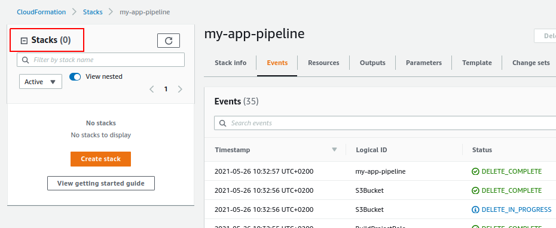
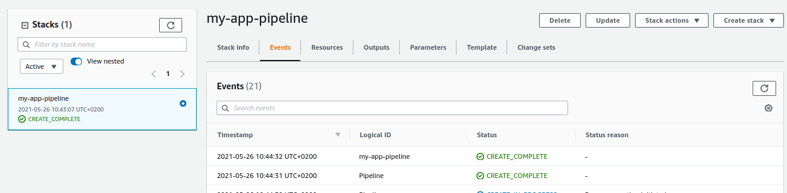
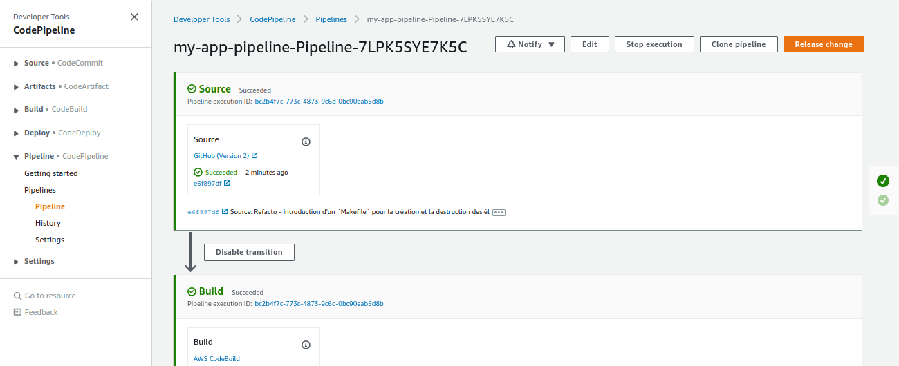

---
title: Pipeline CI/CD d'une application Java dans EC2 - partie 2
date: 10:00 05/26/2021
author: Joseph M'Bimbi-Bene
hero_classes: 'text-light overlay-dark-gradient'
hero_image: article-logo.png
taxonomy:
category: blog
tag: [devops, cloud, tests]
---

Dans cette article, nous allons enrichir notre pipeline et déployer l'application dans une instance EC2.

===


### Sommaire

- [Introduction](#introduction)
  * [Rappel de la cible](#cible)
  * [Rappel des étapes](#etapes)
  * [Plan de l'article](#plan-article)
- [Implémentation avec `CloudFormation`](#implementation-cloudformation)
  * [0. Refacto - Introduction d'un `Makefile` pour la création et la destruction des éléments d'infra](#2.0-refacto-intro-makefile-infra)
- [Références](#references)


###  <a name="introduction-description-du-projet"></a> Introduction

Cette article est le 2e d'une série. Voir aussi:
- [partie 1](https://joseph-mbimbi.fr/blog/codebuild-test-report-demo-part-1)

Le but de cette série d'article est de mettre en place une pipeline de CI/CD d'une application Java dans des instances EC2 dans un autoscaling group derrière un Load Balancer, avec des tests automatisés et la publication de rapports de test.

Nous commençons par rappeler la cible, les étapes pour y arriver, et le scope de cet article.
Ensuite, nous effectuerons l'implémentation pas à pas, avec des tags git pour pouvoir revenir sur les rails en cas de décrochage (ce qui est inévitable, on oublie toujours une action ou une étape)

Bon code

#### <a name="cible"></a> Rappel de la cible

Le but de la série d'articles est d'avoir au final:
- une application Java de base
- une pipeline de CI/CD déployant l'application dans plusieurs instances EC2 derrière un Load Balancer
- des tests unitaires et "d'intégration" (`mvn verify`) sont éxécutés lors de la phase de `Build` de la pipeline
- des tests automatisés sont éxécutés sur l'application après son déploiement dans un environnement de test
- un rapport sur le résultats des "tests unitaires" (`mvn verify`) est publié
- un rapport sur la couverture des "tests unitaires" (`mvn verify`) est publié
- un rapport sur l'éxécution de tests automatisés sur l'environnement de test est publié

#### <a name="etapes"></a> Rappel des étapes

Nous allons réaliser la cible par les étapes suivantes:
1. Mise en place d'une pipeline de "Build" de l'application (pas encore de déploiement), avec éxécuton des tests unitaires et publication des rapports de test
2. Déploiement de l'application dans une instance EC2, avec éxécution de test sur cet instance et publication d'un rapport de test
3. Déploiement dans plusieurs instances derrière un Load Balancer, avec éxécution de tests au niveau du Load Balancer et publication de rapport de tests


#### <a name="plan-article"></a> Plan de l'article

Dans cet article, nous allons réaliser l'étape n°2, à savoir:

- Déploiement de l'application dans une instance EC2
- Test de l'application sur cet environnement
- Publication d'un rapport de test sur l'application déployée 


### <a name="implementation-cloudformation"></a> Implémentation avec `CloudFormation`

#### <a name="2.0-refacto-intro-makefile-infra"></a> 0. Refacto - Introduction d'un `Makefile` pour la création et la destruction des éléments d'infra

tag de départ: `1.13-buildtime-integation-test-cucumber`
tag d'arrivée: `2.0-refacto-intro-makefile-infra`

Dans cette étape, nous allons refacto un peu notre code d'infra. Au lieu d'utiliser un script shell qui fait tout, nous allons introduire un `Makefile` pour nous permettre de créer toute l'infra, ou juste une partie, de manière un peu plus propre.

Il y a probablement une meilleure manière de faire, mais pour le moment ça fera très bien l'affaire.

1. Nous introduisons le Makefile suivant:

```makefile
SHELL := /bin/bash
ifndef APPLICATION_NAME
$(error APPLICATION_NAME is not set)
endif
include infra.env
PIPELINE_STACK_NAME=$(APPLICATION_NAME)-pipeline

all:
	- $(MAKE) pipeline
pipeline:
	./create-pipeline.sh $(APPLICATION_NAME) $(PIPELINE_STACK_NAME)  $(GITHUB_REPO) $(GITHUB_REPO_BRANCH)

delete-all:
	- $(MAKE) delete-pipeline
delete-pipeline:
	./delete-stack-wait-termination.sh $(PIPELINE_STACK_NAME)
```

2. Nous déplaçons le script `create-all.sh` dans le répertoire `infra`, nous le renommons `create-pipeline.sh`, et nous le modifions, de manière à ce que toutes les variables soient transmises en paramètres d'appel du script. Cela a paru approprié sur le moment

```shell
#!/bin/bash

if [[ "$#" -ne 4 ]]; then
  echo -e "usage:\n./create-all.sh \$APPLICATION_NAME \$PIPELINE_STACK_NAME \$GITHUB_REPO \$GITHUB_REPO_BRANCH"
  exit 1
fi

export APPLICATION_NAME=$1
export PIPELINE_STACK_NAME=$2

echo -e "##############################################################################"
echo -e "creating ci/cd pipeline stack"
echo -e "##############################################################################"
aws cloudformation deploy    \
  --stack-name $PIPELINE_STACK_NAME   \
  --template-file pipeline-cfn.yml    \
  --capabilities CAPABILITY_NAMED_IAM   \
  --parameter-overrides     \
    ApplicationName=$APPLICATION_NAME   \
    GithubRepo=$GITHUB_REPO   \
    GithubRepoBranch=$GITHUB_REPO_BRANCH
```

Nous introduisons un script pour supprimer une stack `CloudFormation` quelconque, et qui attend la fin de la suppression. Sans rentrer dans les détails, cela nous évitera des problèmes ultérieurs

```shell
#!/bin/bash

if [[ -z $1 ]]; then
  echo -e "usage:\n./delete-stack-wait-termination.sh \$STACK_NAME"
  exit 1
fi

STACK_NAME=$1

echo -e "##############################################################################"
echo -e "force deleting S3 buckets for stack $STACK_NAME"
echo -e "##############################################################################"
S3_BUCKETS=$(aws cloudformation describe-stack-resources --stack-name $STACK_NAME --query "StackResources[?ResourceType=='AWS::S3::Bucket'].PhysicalResourceId" --output text)
for S3_BUCKET in $S3_BUCKETS
do
  aws s3 rb s3://$S3_BUCKET --force
done

echo -e "##############################################################################"
echo -e "deleting stack $STACK_NAME"
echo -e "##############################################################################"
aws cloudformation delete-stack --stack-name $STACK_NAME
aws cloudformation wait stack-delete-complete --stack-name $STACK_NAME
```

suppression de variables inutilisées et/ou sources d'erreur avec `Makefile`:
```shell
export AWS_REGION=$(aws configure get region)
export ACCOUNT_ID=$(aws sts get-caller-identity --query "Account" --output text)
```

Si vous avez toujours les stacks `CloudFormation` créées dans la partie précédente, profitons-en pour vérifier que le `Makefile` fonctionne bien:

```shell
cd infra
make delete-all APPLICATION_NAME=my-app
```

la stack de la pipeline devrait bien être supprimée:



Recréons la pipeline:

```shell
cd infra #si vous n'y êtes pas deja
make all APPLICATION_NAME=my-app
```

Inspectons la stack `CloudFormation`:



Après avoir activé la connexion github et éventuellement relancé la pipeline si celle-ci a échoué, vous devriez avoir au final une pipeline verte:



Et les rapports de tests devraient bien être uploadés:


## <a name="references"></a> Références
- code source github: [https://github.com/mbimbij/codebuild-test-report-demo](https://github.com/mbimbij/codebuild-test-report-demo)