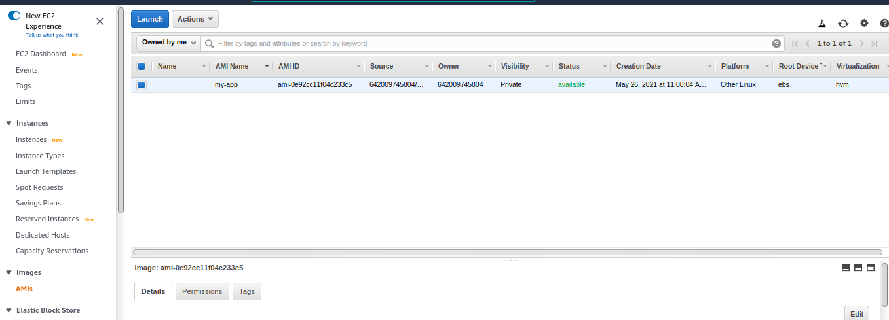
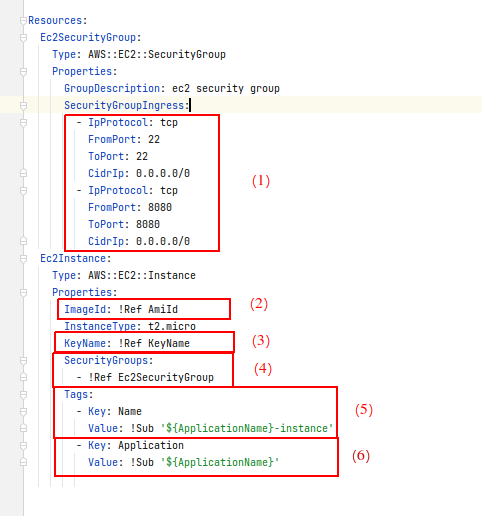

---
title: Pipeline CI/CD d'une application Java dans EC2 - partie 2
date: 10:00 05/26/2021
author: Joseph M'Bimbi-Bene
hero_classes: 'text-light overlay-dark-gradient'
hero_image: article-logo.png
taxonomy:
category: blog
tag: [devops, cloud, tests]
---

Dans cette article, nous allons enrichir notre pipeline et déployer l'application dans une instance EC2.

===


### Sommaire

- [Introduction](#introduction)
  * [Rappel de la cible](#cible)
  * [Rappel des étapes](#etapes)
  * [Plan de l'article](#plan-article)
- [Implémentation avec `CloudFormation`](#implementation-cloudformation)
  * [0. Refacto - Introduction d'un `Makefile` pour la création et la destruction des éléments d'infra](#2.0-refacto-intro-makefile-infra)
  * [1. Création d'une AMI (image EC2) prête à accueillir notre application](#2.1-creation-ami)
  * [2. Création d'une instance EC2 via `CloudFormation`](#2.2-creation-instance-ec2)
  * [3. Déploiement - 1e étape - Copier la sortie du stage `Build` sur l'instance EC2](#2.3-deploy-1-copy-build-output-raw)
  * [4. Intégration d'une interface REST au code Java - `SpringBoot`](#2.4-java-springboot-rest-interface)
  * [5. Déploiement de l'application Java en tant que service `SystemD`](#2.5-deploy-java-application-as-service)
  * [6. Test "d'intégration" sur notre environnement EC2](#2.6-staging-tests-post-deploy)
  * [7. Ajout d'un environnement de "prod"](#2.7-add-prod-environment)
- [Références](#references)


###  <a name="introduction-description-du-projet"></a> Introduction

Cette article est le 2e d'une série. Voir aussi:
- [partie 1](https://joseph-mbimbi.fr/blog/codebuild-test-report-demo-part-1)

Le but de cette série d'article est de mettre en place une pipeline de CI/CD d'une application Java dans des instances EC2 dans un autoscaling group derrière un Load Balancer, avec des tests automatisés et la publication de rapports de test.

Nous commençons par rappeler la cible, les étapes pour y arriver, et le scope de cet article.
Ensuite, nous effectuerons l'implémentation pas à pas, avec des tags git pour pouvoir revenir sur les rails en cas de décrochage (ce qui est inévitable, on oublie toujours une action ou une étape)

Bon code

#### <a name="cible"></a> Rappel de la cible

Le but de la série d'articles est d'avoir au final:
- une application Java de base
- une pipeline de CI/CD déployant l'application dans plusieurs instances EC2 derrière un Load Balancer
- des tests unitaires et "d'intégration" (`mvn verify`) sont éxécutés lors de la phase de `Build` de la pipeline
- des tests automatisés sont éxécutés sur l'application après son déploiement dans un environnement de test
- un rapport sur le résultats des "tests unitaires" (`mvn verify`) est publié
- un rapport sur la couverture des "tests unitaires" (`mvn verify`) est publié
- un rapport sur l'éxécution de tests automatisés sur l'environnement de test est publié

#### <a name="etapes"></a> Rappel des étapes

Nous allons réaliser la cible par les étapes suivantes:
1. Mise en place d'une pipeline de "Build" de l'application (pas encore de déploiement), avec éxécuton des tests unitaires et publication des rapports de test
2. Déploiement de l'application dans une instance EC2, avec éxécution de test sur cet instance et publication d'un rapport de test
3. Déploiement dans plusieurs instances derrière un Load Balancer, avec éxécution de tests au niveau du Load Balancer et publication de rapport de tests


#### <a name="plan-article"></a> Plan de l'article

Dans cet article, nous allons réaliser l'étape n°2, à savoir:

- Déploiement de l'application dans une instance EC2
- Test de l'application sur cet environnement
- Publication d'un rapport de test sur l'application déployée 


### <a name="implementation-cloudformation"></a> Implémentation avec `CloudFormation`

#### <a name="2.0-refacto-intro-makefile-infra"></a> 0. Refacto - Introduction d'un `Makefile` pour la création et la destruction des éléments d'infra

tag de départ: `1.13-buildtime-integation-test-cucumber`
tag d'arrivée: `2.0-refacto-intro-makefile-infra`

Dans cette étape, nous allons refacto un peu notre code d'infra. Au lieu d'utiliser un script shell qui fait tout, nous allons introduire un `Makefile` pour nous permettre de créer toute l'infra, ou juste une partie, de manière un peu plus propre.

Il y a probablement une meilleure manière de faire, mais pour le moment ça fera très bien l'affaire.

1. Nous introduisons le Makefile suivant:

```makefile
SHELL := /bin/bash
ifndef APPLICATION_NAME
$(error APPLICATION_NAME is not set)
endif
include infra.env
PIPELINE_STACK_NAME=$(APPLICATION_NAME)-pipeline

all:
	- $(MAKE) pipeline
pipeline:
	./create-pipeline.sh $(APPLICATION_NAME) $(PIPELINE_STACK_NAME)  $(GITHUB_REPO) $(GITHUB_REPO_BRANCH)

delete-all:
	- $(MAKE) delete-pipeline
delete-pipeline:
	./delete-stack-wait-termination.sh $(PIPELINE_STACK_NAME)
```

2. Nous déplaçons le script `create-all.sh` dans le répertoire `infra`, nous le renommons `create-pipeline.sh`, et nous le modifions, de manière à ce que toutes les variables soient transmises en paramètres d'appel du script. Cela a paru approprié sur le moment

```shell
#!/bin/bash

if [[ "$#" -ne 4 ]]; then
  echo -e "usage:\n./create-all.sh \$APPLICATION_NAME \$PIPELINE_STACK_NAME \$GITHUB_REPO \$GITHUB_REPO_BRANCH"
  exit 1
fi

export APPLICATION_NAME=$1
export PIPELINE_STACK_NAME=$2

echo -e "##############################################################################"
echo -e "creating ci/cd pipeline stack"
echo -e "##############################################################################"
aws cloudformation deploy    \
  --stack-name $PIPELINE_STACK_NAME   \
  --template-file pipeline-cfn.yml    \
  --capabilities CAPABILITY_NAMED_IAM   \
  --parameter-overrides     \
    ApplicationName=$APPLICATION_NAME   \
    GithubRepo=$GITHUB_REPO   \
    GithubRepoBranch=$GITHUB_REPO_BRANCH
```

Nous introduisons un script pour supprimer une stack `CloudFormation` quelconque, et qui attend la fin de la suppression. Sans rentrer dans les détails, cela nous évitera des problèmes ultérieurs

```shell
#!/bin/bash

if [[ -z $1 ]]; then
  echo -e "usage:\n./delete-stack-wait-termination.sh \$STACK_NAME"
  exit 1
fi

STACK_NAME=$1

echo -e "##############################################################################"
echo -e "force deleting S3 buckets for stack $STACK_NAME"
echo -e "##############################################################################"
S3_BUCKETS=$(aws cloudformation describe-stack-resources --stack-name $STACK_NAME --query "StackResources[?ResourceType=='AWS::S3::Bucket'].PhysicalResourceId" --output text)
for S3_BUCKET in $S3_BUCKETS
do
  aws s3 rb s3://$S3_BUCKET --force
done

echo -e "##############################################################################"
echo -e "deleting stack $STACK_NAME"
echo -e "##############################################################################"
aws cloudformation delete-stack --stack-name $STACK_NAME
aws cloudformation wait stack-delete-complete --stack-name $STACK_NAME
```

suppression de variables inutilisées et/ou sources d'erreur avec `Makefile`:
```shell
export AWS_REGION=$(aws configure get region)
export ACCOUNT_ID=$(aws sts get-caller-identity --query "Account" --output text)
```

Si vous avez toujours les stacks `CloudFormation` créées dans la partie précédente, profitons-en pour vérifier que le `Makefile` fonctionne bien:

```shell
cd infra
make delete-all APPLICATION_NAME=my-app
```

la stack de la pipeline devrait bien être supprimée:


Recréons la pipeline:

```shell
cd infra #si vous n'y êtes pas deja
make all APPLICATION_NAME=my-app
```

Inspectons la stack `CloudFormation`:


Après avoir activé la connexion github et éventuellement relancé la pipeline si celle-ci a échoué, vous devriez avoir au final une pipeline verte:


Et les rapports de tests devraient bien être uploadés:


#### <a name="2.1-creation-ami"></a> 1. Création d'une AMI (image EC2) prête à accueillir notre application

tag de départ: `2.0-refacto-intro-makefile-infra`
tag d'arrivée: `2.1-creation-ami`

Dans cette étape, nous allons créer une AMI avec toutes les dépendances et configuration nécessaires pour faire tourner notre application Java. 
Nous nous baserons sur l'outil `Packer` et nous baserons sur une AMI de base `Ubuntu Server 20.04`.
Il existe aussi l'outil d'AWS `EC2 Builder`, mais au moment de la rédaction de cette article, je ne suis pas assez familier avec EC2 Builder, je connais un peu mieux `Packer`, j'ai deja un side project avec sur lequel je peux m'appuyer, je n'ai pas trop envie d'y passer beaucoup de temps, et la création d'AMI n'est pas le but principal de la série d'articles.
Cependant, `EC2 Builder` fera très certainement l'objet d'un prochain side project et d'un article associé.

##### 2.1.1 Création de l'AMI avec Packer

Les actions réalisées sont:

1. ajout du fichier `infra/packer-ami/ubuntu-springboot-ready.json`, qui sera utilisé par `Packer` pour créer notre AMI:

```json
{
  "variables": {
    "ami_id": "",
    "ami_name": "",
    "region": ""
  },
  "builders": [
    {
      "type": "amazon-ebs",
      "access_key": "",
      "secret_key": "",
      "region": "{{user `region`}}",
      "ami_name": "{{user `ami_name`}}",
      "instance_type": "t2.micro",
      "source_ami": "{{user `ami_id`}}",
      "ssh_username": "ubuntu"
    }
  ],
  "provisioners": [
    {
      "type": "shell",
      "script": "setup.sh"
    }
  ]
}
```

Décortiquons un peu ce fichier:


a. On définit des varibles pour notre config `Packer`
b. Des configs de l'instance EC2 utilisée pour constituer notre AMI
  - b.1 On note la présence des varibles définies plus haut
c. Le provisionner est de type `shell` et on utilise le script `setup.sh` juste à côté du fichier json, dont on parlera juste après

2. ajout du fichier `infra/packer-ami/setup.sh`, qui sera utilisé par `Packer` pour provisionner l'instance EC2 à partir de laquelle nous allons créer notre AMI:

```shell
#! /bin/bash

sleep 30

sudo apt update

# installing some utilities
sudo apt install -y tree ncdu mlocate tmux jq

# installing java
sudo apt install openjdk-16-jdk -y

AWS_REGION=$(curl -s http://169.254.169.254/latest/dynamic/instance-identity/document | jq .region -r)
if [[ -z $AWS_REGION ]]; then
  echo "AWS_REGION is empty, defaulting to 'us-east-1'"
  AWS_REGION="us-east-1"
fi
echo "region is: $AWS_REGION"

# installing codedeploy agent
sudo apt-get install ruby wget -y
wget https://aws-codedeploy-$AWS_REGION.s3.$AWS_REGION.amazonaws.com/latest/install
chmod +x ./install
sudo ./install auto | tee /tmp/logfile
sudo systemctl start codedeploy-agent
sudo systemctl enable codedeploy-agent
```

Le script devrait être assez court et lisible, mais, en reprenant les commentaires, on peut le résumer de la manière suivante

a. on installe quelques utilitaires
b. on installe java
c. on installe l'agent `CodeDeploy` -> `CodeDeploy` est un service AWS permettant ... de déployer des applications: dans EC2, ECS, Lambda, etc. mais contrairement à `Ansible` par exemple, cet outil nécessite un agent, qui va "pull" tout ce qu'il y a à déployer

3. On ajoute un script `infra/create-ami.sh`, qui wrappe l'appel à `Packer`:

```shell
#!/bin/bash

if [[ "$#" -ne 3 ]]; then
  echo -e "usage:\n./create-ami.sh \$APPLICATION_NAME \$BASE_AMI_ID \$AWS_REGION"
  exit 1
fi

APPLICATION_NAME=$1
BASE_AMI_ID=$2
AWS_REGION=$3

set -e
cd packer-ami
packer build \
  -var "ami_name=$APPLICATION_NAME" \
  -var "ami_id=$BASE_AMI_ID" \
  -var "region=$AWS_REGION" \
  ubuntu-springboot-ready.json
```

On modifie le `Makefile`, de manière à rajouter les targets: `ami` et `delete-ami`, dont le nom devrait être suffisamment explicite

```makefile
#[...]
all:
	- $(MAKE) pipeline
	- $(MAKE) ami
ami:
	$(eval BASE_AMI_ID := $(shell aws ssm get-parameters --names /aws/service/canonical/ubuntu/server/20.04/stable/current/amd64/hvm/ebs-gp2/ami-id --query 'Parameters[0].[Value]' --output text))
	$(eval AWS_REGION := $(shell aws configure get region))
	./create-ami.sh $(APPLICATION_NAME) $(BASE_AMI_ID) $(AWS_REGION)
#[...]
delete-ami:
	$(eval AMI_ID := $(shell aws ec2 describe-images --owners self --query "Images[?Name=='$(APPLICATION_NAME)'].ImageId" --output text))
	aws ec2 deregister-image --image-id $(AMI_ID)
```

Vérifions que tout cela fonctionne, en déclenchant la target `ami` ou `all` (qui sont le facto "idempotent"):

```shell
cd infra #si vous n'y êtes pas deja
make all APPLICATION_NAME=my-app
```

La création de l'AMI est assez longue et prend chez moi environ 10-15 minutes, soyez patients.

Vérifions dans la console AWS:



##### 2.1.2 Création manuelle d'une instance EC2 à partir de notre image

Créons rapidement une instance à partir de cette AMI, dans la console, cliquez sur "Actions > Launch":


Cliquez sur "Review and Launch":


Cliquez sur "Launch":


Si vous avez deja une paire de clés ssh et que vous êtes familier avec la procédure, sélectionnez une paire de clés existante.

Sinon:
- sélectionnez `Create a new key pair` au lieu de `Choose an existing key pair`


1. donnez par exemple le nom "keys" à la paire de clés
2. téléchargez le fichier `keys.pem`
3. cliquez sur "Launch Instances"


Dans le menu de gauche, allez dans "Instances", vous devriez voir votre instance dans l'état "Running" au bout d'une poignée de minutes maximum:


Nous allons nous y connecter en ssh. Il y a plusieurs manières de l'effectuer, allons au plus facile:
- cliquez sur "Connect":


Dans la fenêtre suivante:
1. sélectionnez "EC Instance Connect" 
2. cliquez sur "Connect"


Un nouvel onglet s'ouvre, avec un terminal:


1. On est loggé en tant que `root`
2. On peut vérifier l'installation de java avec `java -version`
3. On peut vérifier l'installation et l'état de l'agent `CodeDeploy` avec `systemctl status codedeploy-agent.service`

Prochaine étape, automatiser cette création d'instance 

#### <a name="2.2-creation-instance-ec2"></a> 2. Création d'une instance EC2 via `CloudFormation`

tag de départ: `2.1-creation-ami`
tag d'arrivée: `2.2-creation-instance-ec2`

Le titre est assez explicite, dans cette étape, nous allons créer une instance EC2 avec `CloudFormation` 

Pour cela, nous allons effectuer les actions, ajouts, modifications suivantes:

1. Import d'une paire de clés SSH dans le compte AWS

  - fichier `infra/create-ssh-key-pair.sh` 

```shell
#!/bin/bash

if [[ "$#" -ne 2 ]]; then
  echo -e "usage:\n./create-all.sh \$SSH_KEY_NAME \$SSH_KEY_PATH"
  exit 1
fi

export SSH_KEY_NAME=$1
export SSH_KEY_PATH=$2

echo -e "##############################################################################"
echo -e "creating ssh key pair \"$SSH_KEY_NAME\" from $SSH_KEY_PATH"
echo -e "##############################################################################"
PUBLIC_KEY_BASE_64=$(cat $SSH_KEY_PATH | base64)
aws ec2 import-key-pair --key-name $SSH_KEY_NAME --public-key-material "$PUBLIC_KEY_BASE_64"
```

On ne peut pas créer de paire de clés SSH via `CloudFormation`, on se contera de la CLI AWS dans ce cas. 

Que dire de particulier, il faut transmettre le contenu de la clé publique encodé en base64.

  - fichier `infra/infra.env`

```dotenv
export GITHUB_REPO=mbimbij/codebuild-test-report-demo # deja présent
export GITHUB_REPO_BRANCH=main                        # deja présent
export SSH_KEY_NAME=local
export SSH_KEY_PATH=~/.ssh/id_rsa.pub
```

Pour cette démo, on utilise la clé publique: `~/.ssh/id_rsa.pub`, que l'on uploadera avec l'id `local`. 

Ainsi, si vous avez deja une paire de clés (et en tant que programmeur, sous linux, je présume que c'est le cas), cela devrait faciliter l'utilisation de ce projet / tutorial, et la connexion à l'instance EC2.

2. Ajout d'un template `CloudFormation` pour l'instance EC2, fichier `infra/execution-environment-cfn.yml`:

```yaml
Parameters:
  ApplicationName:
    Type: String
    Description: Application Name
  KeyName:
    Type: String
    Description: Key Name
  AmiId:
    Type: AWS::EC2::Image::Id
    Description: Ami Id

Resources:
  Ec2SecurityGroup:
    Type: AWS::EC2::SecurityGroup
    Properties:
      GroupDescription: ec2 security group
      SecurityGroupIngress:
        - IpProtocol: tcp
          FromPort: 22
          ToPort: 22
          CidrIp: 0.0.0.0/0
        - IpProtocol: tcp
          FromPort: 8080
          ToPort: 8080
          CidrIp: 0.0.0.0/0
  Ec2Instance:
    Type: AWS::EC2::Instance
    Properties:
      ImageId: !Ref AmiId
      InstanceType: t2.micro
      KeyName: !Ref KeyName
      SecurityGroups:
        - !Ref Ec2SecurityGroup
      Tags:
        - Key: Name
          Value: !Sub '${ApplicationName}-instance'
        - Key: Application
          Value: !Sub '${ApplicationName}'
```

Analysons ce template:



- 1. On définit un `Security Group` autorisant les connexions entrantes sur les ports: 
  - 22, pour pouvoir y accéder en ssh
  - 8080, car c'est le port par défaut sur lequel se binde les applications `SpringBoot`, que nous allons utiliser par la suite.
- 2. On fait référence à un paramètre `AmiId`, dans lequel on placera l'id de l'AMI que l'on a créé dans l'étape #1
- 3. On fait référence à la paire de clés définie juste avant, qui est la clé ssh publique de notre poste de développement
- 4. On associe le `security group` à l'instance
- 5. On définit un tag "Name", afin que l'instance ait un nom dans la console AWS
- 6. On définit un tag "Application", ayant le nom de l'application. Plus tard, on utilisera ce nom pour le déploiement


3. modifications dans le fichier `infra/Makefile` :

```makefile
SHELL := /bin/bash
ifndef APPLICATION_NAME
$(error APPLICATION_NAME is not set)
endif
include infra.env
PIPELINE_STACK_NAME=$(APPLICATION_NAME)-pipeline
EXECUTION_ENVIRONMENT_STACK_NAME=$(APPLICATION_NAME)-execution-environment

all:
	- $(MAKE) pipeline
	- $(MAKE) ami
	- $(MAKE) execution-environment
pipeline:
	./create-pipeline.sh $(APPLICATION_NAME) $(PIPELINE_STACK_NAME) $(GITHUB_REPO) $(GITHUB_REPO_BRANCH)
ami:
	$(eval BASE_AMI_ID := $(shell aws ssm get-parameters --names /aws/service/canonical/ubuntu/server/20.04/stable/current/amd64/hvm/ebs-gp2/ami-id --query 'Parameters[0].[Value]' --output text))
	$(eval AWS_REGION := $(shell aws configure get region))
	./create-ami.sh $(APPLICATION_NAME) $(BASE_AMI_ID) $(AWS_REGION)
ssh-key-pair:
	./create-ssh-key-pair.sh $(SSH_KEY_NAME) $(SSH_KEY_PATH)
execution-environment: ssh-key-pair
	$(eval AMI_ID := $(shell aws ec2 describe-images --owners self --query "Images[?Name=='$(APPLICATION_NAME)'].ImageId" --output text))
	./create-execution-environment.sh $(APPLICATION_NAME) $(EXECUTION_ENVIRONMENT_STACK_NAME) $(AMI_ID) $(SSH_KEY_NAME)


delete-all:
	- $(MAKE) delete-pipeline
delete-pipeline:
	./delete-stack-wait-termination.sh $(PIPELINE_STACK_NAME)
delete-ami:
	$(eval AMI_ID := $(shell aws ec2 describe-images --owners self --query "Images[?Name=='$(APPLICATION_NAME)'].ImageId" --output text))
	aws ec2 deregister-image --image-id $(AMI_ID)
delete-ssh-key-pair:
	aws ec2 delete-key-pair --key-name $(SSH_KEY_NAME)
delete-execution-environment: delete-ssh-key-pair
	./delete-stack-wait-termination.sh $(EXECUTION_ENVIRONMENT_STACK_NAME)
```

Jetons un oeil du côté des ajouts effectués:


Pas grand chose à ajouter, un ajoute des targets pour créer la paire de clés et l'instance, ainsi que pour les détruire

Vérifions la création :

```shell
cd infra #si vous n'y êtes pas deja
make all APPLICATION_NAME=my-app
```


L'instance est bien créé. Vérifions que l'on peut s'y connecter en utilisant notre clé ssh par défaut (sans l'expliciter)


Parfait ! Prochaine étape, revenir sur la pipeline, et réussir à pousser la sortie de l'étape de build sur l'instance EC2. Première étape pour déployer l'application Java

#### <a name="2.3-deploy-1-copy-build-output-raw"></a> 3. Déploiement - 1e étape - Copier la sortie du stage `Build` sur l'instance EC2 

tag de départ: `2.2-creation-instance-ec2`
tag d'arrivée: `2.3-deploy-1-copy-build-output-raw`

Dans cette étape, nous allons créer un "stage" de déploiement dans la pipeline. Pour rester dans une approche baby-step, nous allons nous contenter de copier la sortie brute du stage "Build" de cette même pipeline.

Pour cela nous effectuons les actions suivantes:

1. Modification du template de la Pipeline, `infra/pipeline-cfn.yml`, pour y ajouter un stage "Deploy"
  - 1.1 Ajout d'une permission au rôle `PipelineRole` pour lui permettre d'éxécuter des déploiements basés sur `CodeDeploy`

```yaml
- Effect: Allow
  Action:
    - codedeploy:*
  Resource: !Sub 'arn:${AWS::Partition}:codedeploy:${AWS::Region}:${AWS::AccountId}*'
```
  - 1.2 Modification du `buildspec` dans la ressource `BuildProject` afin de copier tous les fichiers dans les "OutputArtifacts"

```yaml
artifacts:
  files:
    - '**/*'
```

  - 1.3 Ajout d'une ressource: `CodeDeployApplication` qui sera le projet / application `CodeDeploy`
  
```yaml
CodeDeployApplication:
  Type: AWS::CodeDeploy::Application
  Properties:
    ApplicationName: !Sub '${ApplicationName}-deploy-application'
    ComputePlatform: Server
```

  - 1.4 Ajout d'une ressource: `CodeDeployDeploymentGroup` -> un groupe de déploiement de l'application précédente, qui va concrètement procéder au déploiement, à partir d'un fichier `appspec.yml` dans les artefacts en entrée
    
```yaml
CodeDeployDeploymentGroup:
  Type: AWS::CodeDeploy::DeploymentGroup
  Properties:
    ApplicationName: !Ref CodeDeployApplication
    ServiceRoleArn: !GetAtt
      - CodeDeployRole
      - Arn
    DeploymentGroupName: !Sub '${ApplicationName}-deployment-group'
    DeploymentConfigName: CodeDeployDefault.OneAtATime
    Ec2TagFilters:
      - Key: Application
        Value: !Ref ApplicationName
        Type: KEY_AND_VALUE
```

  - 1.5 Ajout d'une ressource: `CodeDeployRole` -> le rôle que va utiliser le groupe de déploiement. On lui attache une policy managée par AWS: `AWSCodeDeployRole`

```yaml
CodeDeployRole:
  Type: 'AWS::IAM::Role'
  Description: IAM role for !Ref ApplicationName code deploy deployment group
  Properties:
    RoleName: !Join
      - '-'
      - - !Ref ApplicationName
        - deploy-role
    AssumeRolePolicyDocument:
      Statement:
        - Action: "sts:AssumeRole"
          Effect: Allow
          Principal:
            Service:
              - codedeploy.amazonaws.com
    ManagedPolicyArns:
      - arn:aws:iam::aws:policy/service-role/AWSCodeDeployRole
```

  - 1.6 Ajout d'un stage `Deploy` à la ressource: `Pipeline`

```yaml
- Name: Deploy
  Actions:
    - Name: Deploy
      InputArtifacts:
        - Name: BuildOutput
      ActionTypeId:
        Category: Deploy
        Owner: AWS
        Version: 1
        Provider: CodeDeploy
      Configuration:
        ApplicationName:
          Ref: CodeDeployApplication
        DeploymentGroupName:
          Ref: CodeDeployDeploymentGroup
      RunOrder: 1
```

2. Modification du template de l'instance ec2, `infra/execution-environment-cfn.yml`


  - 2.1 On associe à l'instance EC2 le profile `Ec2InstanceProfile`
  - 2.2 On définit la ressource pour le profile `Ec2InstanceProfile`, on y associant le rôle IAM `Ec2InstanceRole`
  - 2.3 On définit le rôle IAM `Ec2InstanceRole`, ayant les policies managées
    - `AmazonEC2RoleforAWSCodeDeploy`, pour permettre à l'agent `codedeploy` de récupérer les artefacts depuis S3
    - `AmazonSSMManagedInstanceCore`, pour permettre à l'instance de s'enregistrer auprès de `System Manager`. Sans cela, le déploiement reste indéfiniment dans l'état `Pending`, sans absolument aucune log ... 

3. Un fichier `appspec` ultra minimaliste. La présence de ce fichier est obligatoire

```yaml
version: 0.0
os: linux
```

... Et rien de plus !

Mettons à jour notre infra: 

```shell
cd infra #si vous n'y êtes pas deja
make all APPLICATION_NAME=my-app
```

poussons le code dans le repo git relançons une release dans la pipeline si elle n'est pas déclenchée automatiquement. Tout devrait être vert:


Allons jeter un oeil au déploiement dans `CodeDeploy`. Dans "Deploy > Deployments", rafraîchir éventuellement:


J'ai plusieurs déploiement dans mon screenshot, en espérant que cela ne soit pas source de confusion.

Notons l'id du dernier déploiement

connectons-nous en ssh sur l'instance EC2 :

```shell
Last login: Thu May 27 08:15:01 2021 from 176.173.232.167
ubuntu@ip-172-31-40-53:~$ cd /opt/codedeploy-agent/deployment-root/<some-deployment-group-id>/<last-deployment-id>/deployment-archive/
ubuntu@ip-172-31-40-53:/opt/codedeploy-agent/deployment-root/1abcd735-aa71-4a4d-8f68-ccc88a65d2e4/d-C1CX5XBU8/deployment-archive$ ls
README.md  appspec.yml  blog-article  infra  pom.xml  reposition-tag.sh  src  target
```

l'id du groupe de déploiement, ainsi que du dernier déploiement, seront différents chez vous.

Cependant, on peut constater que le code source et le répertoire `target` sont bien présents dans l'instance EC2. 

Félicitations, nous avons bien réssui à effectuer un premier déploiement.

Prochaine étape, créer une interface REST dans le code `Java`, déployer l'application en tant que service et vérifier que tout fonctionne bien.

#### <a name="2.4-java-springboot-rest-interface"></a> 4. Intégration d'une interface REST au code Java - `SpringBoot`

tag de départ: `2.3-deploy-1-copy-build-output-raw`
tag d'arrivée: `2.4-java-springboot-rest-interface`

Dans cette étape, nous allons rajouter une interface REST très simple, en utilisant `SpringBoot`.

Nous rajoutons ou modifions:
- le fichier `pom.xml`:
  - ajout du `spring-boot-parent`
  - ajout des dépendances `spring-boot-starter-web` et `spring-boot-starter-test`
  - exclusion de la classe `MySpringApplication` de la couverture de test
- un main `SpringBoot`: `MySpringApplication`
- un controller REST `SpringBoot`: `MyRestController`
- un test du controller REST: `MyRestControllerIT`
  - Après hésitation et une recherche rapide google, j'ai décidé de le suffixer en `IT` plutôt qu'en `Test`, dans la mesure où un contexte Spring est créé et que ce test prend quelques seconde. Mais habituellement je suffixe avec `Test`, je peux entendre les arguments dans les 2 sens, surtout quand on teste une "slice" de l'application uniquement (BDD, messaging, REST) et qu'on mock le reste. En ce qui me concerne, la question de où placer et nommer ce genre de tests de manière standard reste ouverte. 

On peut vérifier que tout marche comme il le faut, inspecter en local les rapports de test et de couverteure via un `mvn clean verify` 

#### <a name="2.5-deploy-java-application-as-service"></a> 5. Déploiement de l'application Java en tant que service `SystemD`

tag de départ: `2.4-java-springboot-rest-interface`
tag d'arrivée: `2.5-deploy-java-application-as-service`

Dans cette étape, nous allons déployer l'application Java en tant que service `SystemD`, puis vérifier manuellement que l'on peut accéder à l'endpoint REST, et que la pipeline déploie bien les mises à jour du code

1. modification de `./infra/pipeline-cfn.yml`: nous modifions le `buildspec` de la ressource `BuildProject`, qui devient:

```yaml
version: 0.2
phases:
  install:
    runtime-versions:
      java: corretto11
  build:
    commands:
      - mvn verify
  post_build:
    commands:
      # move the jar (by wildcard, agnostic to its name) to top level application.jar
      - mv target/*.jar application.jar
    finally:
      - find target/surefire-reports/ -name "*Cucumber*" -delete
      - find target/failsafe-reports/ -name "*Cucumber*" -delete
reports:
  BuildTimeTests:
    files:
      - 'target/surefire-reports/TEST*.xml'
      - 'target/failsafe-reports/TEST*.xml'
      - 'target/cucumber-reports/buildtime/cucumber-results.xml'
      - 'target/cucumber-reports/buildtime/cucumber-integration-results.xml'
  CoverageReport:
    files:
      - 'target/site/jacoco-aggregate/jacoco.xml'
    file-format: 'JACOCOXML'
cache:
  paths:
    - '/root/.m2/**/*'
artifacts:
  files:
    - application.jar
    - appspec.yml
    - 'scripts/*'
    - application.service
```

Analysons les différences:


- 1. On déplace le jar au top niveau, en lui donnant le nom `application.jar`. Comme l'indique le commentaire, ça permet au déploiement d'être "agnostique" quand au nom du projet, de sa version, et de l'artefact généré, et permet à la conf et aux fichiers liés au déploiement d'être assez génériques et réutilisables sur d'autres projets
- 2. On place dans la sortie du stage "Build" uniquement les fichiers nécessaires:
  - `application.jar`, de manière assez évidente
  - `appspec.yml`: le descriptif du déploiement
  - `scripts/*`: tous les scripts utilisés par `appspec.yml` pour le déploiement
  - `application.service`, pour pouvoir créer un service `SystemD` pour l'application 

2. On ajoute un script `scripts/stop_server.sh`:

```shell
#! /bin/bash
systemctl stop application
```

3. On ajoute un script `scripts/before_install.sh`:

```shell
#! /bin/bash
mkdir -p /opt/application/                      # on installera nos artefacts dans /opt/application/ 
rm -rf /etc/systemd/system/application.service  # on supprime le service existant
rm -rf /opt/application/application.jar         # on supprime le jar existant
```

4. On ajoute un script `scripts/start_server.sh`:

```shell
#! /bin/bash
systemctl daemon-reload                         # au cas où le nouveau fichier de service est différent de l'ancien
systemctl start application                     # on démarre le service
```

5. On ajoute un script `scripts/validate_service.sh`:

```shell
#! /bin/bash
#! /bin/bash
PORT=8080
RETRY_INTERVAL_SECONDS=2
until curl -X GET "http://localhost:$PORT"
do
  echo "Application not listening yet on port $PORT. Retrying in $RETRY_INTERVAL_SECONDS second(s)..."
  sleep $RETRY_INTERVAL_SECONDS
done
```

6. On ajoute un fichier `application.service`:

```
[Unit]
Description=application
After=syslog.target

[Service]
User=ubuntu
ExecStart=java -jar /opt/application/application.jar
SuccessExitStatus=143

[Install]
WantedBy=multi-user.target
```

Que l'on a récupéré depuis la documentation de SpringBoot [https://docs.spring.io/spring-boot/docs/current/reference/html/deployment.html#deployment.installing.nix-services.system-d](https://docs.spring.io/spring-boot/docs/current/reference/html/deployment.html#deployment.installing.nix-services.system-d) 

7. On a ajouté du contenu au fichier `appspec.yml`, dont le contenu est maintenant:

```yaml
version: 0.0
os: linux
files:
  - source: /application.service
    destination: /etc/systemd/system
  - source: /application.jar
    destination: /opt/application
hooks:
  ApplicationStop:
    - location: scripts/stop_server.sh
      timeout: 10
      runas: root
  BeforeInstall:
    - location: scripts/before_install.sh
      timeout: 5
      runas: root
  AfterInstall:
    - location: scripts/start_server.sh
      timeout: 5
      runas: root
  ValidateService:
    - location: scripts/validate_service.sh
      timeout: 20
      runas: root
```


Analysons rapidement les différences:


- 1. On copie le fichier `.service` dans l'un des répertoires utilisés par `SystemD` pour référencer les déclarations de services
  - la racine de la "source" est le répertoire de déploiement, soit, en reprenant une des étapes précédentes : `/opt/codedeploy-agent/deployment-root/<some-deployment-group-id>/<last-deployment-id>/deployment-archive/`
  - la racine de la destination par contre est bien la racine du filesystem
- 2. On copie le `.jar` vers le réperoire que l'on a choisi pour acceuillir les artefacts du déploiement
- 3. Lors de la phase `ApplicationStop` du cycle de vie du déploiement, on éxécute le script `scripts/stop_server.sh` en tant que user `root`, avec un timeout de 10 secondes
- 4. Lors de la phase `BeforeInstall` du cycle de vie du déploiement, on éxécute le script `scripts/before_install.sh` en tant que user `root`, avec un timeout de 10 secondes
- 5. Lors de la phase `AfterInstall` du cycle de vie du déploiement, on éxécute le script `scripts/start_server.sh` en tant que user `root`, avec un timeout de 10 secondes
- 6. Lors de la phase `ValidateService` du cycle de vie du déploiement, on éxécute le script `scripts/start_server.sh` en tant que user `root`, avec un timeout de 20 secondes. Ce script effectue un "sanity check" de l'application, et vérifie qu'elle va être en mesure de répondre à un curl sur le port 8080

Plus d'infos sur le cycle de vie d'un déploiement sur EC2 / On-premises et les différents hooks dispos ici:
[https://docs.aws.amazon.com/codedeploy/latest/userguide/reference-appspec-file-structure-hooks.html#appspec-hooks-server](https://docs.aws.amazon.com/codedeploy/latest/userguide/reference-appspec-file-structure-hooks.html#appspec-hooks-server)

Mettons à jour notre pipeline:

```shell
cd infra #si vous n'y êtes pas deja
make pipeline APPLICATION_NAME=my-app # `make all APPLICATION_NAME=my-app` marcherait tout aussi bien
```

Enfin poussons nos modifications et déclenchons une release sur la pipeline au besoin, elle devrait être verte:


Le port 8080 étant accessible sur l'instance EC2, on devrait pouvoir interroger l'interface REST via `curl` ou un navigateur:

```shell
joseph@joseph-ThinkPad-T480 infra ±|main ✗|→ curl ubuntu@ec2-35-181-54-196.eu-west-3.compute.amazonaws.com:8080 -w "\n"
hello world
```

Hourra, notre web service est bien déployé. Vérifions maintenant que notre pipeline déploie comme il faut une modification du code. Modifions la réponse du controlleur REST:

```java
package org.example;

import org.springframework.web.bind.annotation.GetMapping;
import org.springframework.web.bind.annotation.RestController;

@RestController
public class MyRestController {

  public static final String RESPONSE = "hello world 2";

  @GetMapping("/")
  public String get() {
    return RESPONSE;
  }
}
```

Poussons cette modification.
La pipeline devrait toujours être verte. 

Une fois le déploiement terminé, effectuons à nouveau notre requête `curl`:

```shell
joseph@joseph-ThinkPad-T480 infra ±|main ✗|→ curl ubuntu@ec2-35-181-54-196.eu-west-3.compute.amazonaws.com:8080 -w "\n"
hello world 2
```

Parfait. Nous pouvons passer à la prochaine étape.

#### <a name="2.6-staging-tests-post-deploy"></a> 6. Test "d'intégration" sur notre environnement EC2

tag de départ: `2.5-deploy-java-application-as-service`
tag d'arrivée: `2.6-staging-tests-post-deploy`

Dans cette étape, nous allons rajouter une action au stage "Deploy" de notre pipeline, afin de lancer un test `Cucumber`, vérifiant la réponse de l'endpoint REST.

##### <a name="2.6.1-refactos-et-correctifs"></a> 6.1 Refactos et correctifs

Nous commençons par corriger la target `delete-all` dans le `Makefile`, à laquelle il manquait des étapes


##### <a name="2.6.2-ajout-test-staging-cucumber-java"></a> 6.2 Ajout d'un test `Cucumber`

Nous ajoutons une dépendance `Maven`:

```xml
<dependency>
    <groupId>org.projectlombok</groupId>
    <artifactId>lombok</artifactId>
    <scope>provided</scope>
</dependency>
```

Nous ajoutons la feature suivante dans `./src/test/resources/features/staging/test-staging.feature` :

```gherkin
Feature: API test

  Scenario: API returns expected response
    When we call the REST endpoint "/"
    Then the REST response is as following:
      | httpStatus | 200           |
      | body       | "hello world" |
```

Nous ajoutons la classe d'implémentation des steps,`/src/test/java/org/example/CucumberStepDefinitionsStaging.java`:

```java
package org.example;

import io.cucumber.java.en.Then;
import io.cucumber.java.en.When;
import lombok.extern.slf4j.Slf4j;
import org.springframework.http.ResponseEntity;
import org.springframework.web.client.RestTemplate;

import java.util.Map;

import static org.assertj.core.api.Assertions.assertThat;

@Slf4j
public class CucumberStepDefinitionsStaging {

  private ResponseEntity<String> responseEntity;

  @When("we call the REST endpoint {string}")
  public void weCallTheRESTEndpoint(String endpoint) {
    String restEndpointUrl = buildEndpointUrl();
    log.info("calling url: \"{}\"",restEndpointUrl);
    responseEntity = new RestTemplate().getForEntity(restEndpointUrl, String.class);
  }

  private String buildEndpointUrl() {
    String restEndpointHostname = System.getenv("REST_ENDPOINT_HOSTNAME");
    String restEndpointProtocol = System.getenv("REST_ENDPOINT_PROTOCOL");
    String restEndpointPort = System.getenv("REST_ENDPOINT_PORT");
    return restEndpointProtocol+"://"+restEndpointHostname+":"+restEndpointPort;
  }

  @Then("the REST response is as following:")
  public void theRESTResponseIsAsFollowing(Map<String, String> expectedValues) {
    assertThat(responseEntity.getStatusCodeValue()).isEqualTo(200);
    assertThat(responseEntity.getBody()).isEqualTo(MyRestController.RESPONSE);
  }
}
```

Le runner:

```java
package org.example;

import io.cucumber.junit.Cucumber;
import io.cucumber.junit.CucumberOptions;
import org.junit.runner.RunWith;
import org.springframework.boot.test.context.SpringBootTest;

import static org.springframework.boot.test.context.SpringBootTest.WebEnvironment.RANDOM_PORT;

@SpringBootTest(webEnvironment = RANDOM_PORT)
@RunWith(Cucumber.class)
@CucumberOptions(
    plugin = {
        "pretty",
        "junit:target/cucumber-reports/staging/cucumber-staging-results.xml",
        "usage:target/cucumber-reports/staging/cucumber-staging-usage.json"},
    glue = {"org.example"},
    features = "src/test/resources/features/staging")
public class CucumberRunnerStaging {
}
```

##### <a name="2.6.3-ajout-action-test-pipeline"></a> 6.3 Ajout d'une action de test dans la pipline 

Nous ajoutons l'export suivant dans le template de l'instance ec2, `./infra/execution-environment-cfn.yml`:

```yaml
Outputs:
  Ec2InstancePublicDnsName:
    Value: !GetAtt
      - Ec2Instance
      - PublicDnsName
    Export:
      Name: Ec2InstancePublicDnsName
```

Nous ajoutons un rôle pour le projet `CodeBuild` qui lancera les tests, en tant que ressource `CloudFormation`, dans le fichier `./infra/pipeline-cfn.yml` :

```yaml
StagingTestsRole:
  Type: 'AWS::IAM::Role'
  Description: IAM role for !Ref ApplicationName staging test (using CodeBuild)
  Properties:
    RoleName: !Join
      - '-'
      - - !Ref ApplicationName
        - staging-test-role
    Path: /
    Policies:
      - PolicyName: !Join
          - '-'
          - - !Ref ApplicationName
            - staging-test-policy
        PolicyDocument:
          Statement:
            - Effect: Allow
              Action:
                - s3:PutObject
                - s3:GetObject
                - s3:GetObjectVersion
                - s3:GetBucketAcl
                - s3:GetBucketLocation
              Resource:
                - !Sub 'arn:${AWS::Partition}:s3:::${S3Bucket}'
                - !Sub 'arn:${AWS::Partition}:s3:::${S3Bucket}/*'
            - Effect: Allow
              Action:
                - logs:CreateLogGroup
                - logs:CreateLogStream
                - logs:PutLogEvents
              Resource: !Sub 'arn:${AWS::Partition}:logs:${AWS::Region}:${AWS::AccountId}:log-group:/aws/codebuild/*'
            - Effect: Allow
              Action:
                - codebuild:CreateReportGroup
                - codebuild:CreateReport
                - codebuild:UpdateReport
                - codebuild:BatchPutTestCases
                - codebuild:BatchPutCodeCoverages
              Resource: !Sub 'arn:${AWS::Partition}:codebuild:${AWS::Region}:${AWS::AccountId}:report-group/${ApplicationName}-*'
    AssumeRolePolicyDocument:
      Statement:
        - Action: "sts:AssumeRole"
          Effect: Allow
          Principal:
            Service:
              - codebuild.amazonaws.com
```

Nous ajoutons un rôle pour le projet `CodeBuild` qui lancera les tests, en tant que ressource `CloudFormation`, dans le fichier `./infra/pipeline-cfn.yml`. Il s'agit du même rôle que le projet `CodeBuild` qui s'occupe strictement du build, avec les mêmes permissions. Pour le moment, on se contente de copier-coller, mais dans un prochain temps, on cherchera à factoriser les 2 ressources:

```yaml
StagingTestsRole:
  Type: 'AWS::IAM::Role'
  Description: IAM role for !Ref ApplicationName staging test (using CodeBuild)
  Properties:
    RoleName: !Join
      - '-'
      - - !Ref ApplicationName
        - staging-test-role
    Path: /
    Policies:
      - PolicyName: !Join
          - '-'
          - - !Ref ApplicationName
            - staging-test-policy
        PolicyDocument:
          Statement:
            - Effect: Allow
              Action:
                - s3:PutObject
                - s3:GetObject
                - s3:GetObjectVersion
                - s3:GetBucketAcl
                - s3:GetBucketLocation
              Resource:
                - !Sub 'arn:${AWS::Partition}:s3:::${S3Bucket}'
                - !Sub 'arn:${AWS::Partition}:s3:::${S3Bucket}/*'
            - Effect: Allow
              Action:
                - logs:CreateLogGroup
                - logs:CreateLogStream
                - logs:PutLogEvents
              Resource: !Sub 'arn:${AWS::Partition}:logs:${AWS::Region}:${AWS::AccountId}:log-group:/aws/codebuild/*'
            - Effect: Allow
              Action:
                - codebuild:CreateReportGroup
                - codebuild:CreateReport
                - codebuild:UpdateReport
                - codebuild:BatchPutTestCases
                - codebuild:BatchPutCodeCoverages
              Resource: !Sub 'arn:${AWS::Partition}:codebuild:${AWS::Region}:${AWS::AccountId}:report-group/${ApplicationName}-*'
    AssumeRolePolicyDocument:
      Statement:
        - Action: "sts:AssumeRole"
          Effect: Allow
          Principal:
            Service:
              - codebuild.amazonaws.com
```

On ajoute la ressource `CodeBuild`, chargée d'éxécuter les tests:

```yaml
StagingTest:
  Type: AWS::CodeBuild::Project
  Properties:
    Name: !Join
      - '-'
      - - !Ref ApplicationName
        - staging-test
    Description: A build project for !Ref ApplicationName
    ServiceRole: !Ref BuildProjectRole
    Artifacts:
      Type: CODEPIPELINE
      Packaging: ZIP
    Environment:
      Type: LINUX_CONTAINER
      ComputeType: BUILD_GENERAL1_SMALL
      Image: aws/codebuild/amazonlinux2-x86_64-standard:3.0
      EnvironmentVariables:
        - Name: REST_ENDPOINT_HOSTNAME
          Type: PLAINTEXT
#            Value: "toto"
          Value: !ImportValue Ec2InstancePublicDnsName
        - Name: REST_ENDPOINT_PROTOCOL
          Type: PLAINTEXT
          Value: 'http'
        - Name: REST_ENDPOINT_PORT
          Type: PLAINTEXT
          Value: '8080'
    Cache:
      Type: S3
      Location: !Sub '${S3Bucket}/maven-cache'
    Source:
      Type: CODEPIPELINE
      BuildSpec: |
        version: 0.2
        phases:
          install:
            runtime-versions:
              java: corretto11
          build:
            commands:
              - mvn test -Dtest=CucumberRunnerStaging
        reports:
          Report:
            files:
              - 'target/cucumber-reports/staging/cucumber-staging-results.xml'
        cache:
          paths:
            - '/root/.m2/**/*'
```

Ici aussi, il s'agit de la même ressource que pour le build, mais l'on a changé le buildspec. On pourra factoriser cette duplication dans un second temps.

Enfin, toujours dans le template `CloudFormation`, nous ajoutons l'action de test dans la pipeline et nous ajoutons un ordre entre les actions pour s'assurer que le test se déroule après le déploiement:

```yaml
- Name: Deploy
  Actions:
    - Name: Deploy
      RunOrder: 1
      # [...]
    - Name: StagingTest
      RunOrder: 2
      InputArtifacts:
          - Name: SourceOutput
      ActionTypeId:
        Category: Build
        Owner: AWS
        Version: 1
        Provider: CodeBuild
      Configuration:
        ProjectName:
          Ref: StagingTest
```

Avec une visualisation du diff pour plus de clareté:


Enfin, on réordonne les sub-targets de la target `all` du `Makefile`, `execution-environment` devant s'éxécuter avant, car le template utilisé dans la target `pipeline` utilise une sortie `CloudFormation` exportée par le template utilisé dans `execution-environment`.


##### <a name="2.6.4-maj-infra-execution-pipeline"></a> 6.4 Mise à jour de l'infra et éxécution de la pipeline

Mettons à jour notre infra:

```shell
cd infra #si vous n'y êtes pas deja
make all APPLICATION_NAME=my-app
```

Si jamais vous avec un problème,

```shell
cd infra #si vous n'y êtes pas deja
make delete-all APPLICATION_NAME=my-app # en pensant à rajouter le correctif pour supprimer TOUTES les targets
# puis activer la connexion github 
```

Ensuite, poussez le code et relancez une release dans la pipeline si ce n'est pas fait automatiquement:

Celle-ci devrait être verte, ici un screenshot focalisé sur le stage `Deploy`:


Allons regarder le projet `CodeBuild` de ces tests:


Maintenant le rapport de tests:


Et la sortie du test:


Parfait !
Nous pouvons passer à la prochaine étape, à savoir: rajouter une instance EC2 que l'on définira comme notre "prod", et redéfinir notre instance existante comme notre "staging"

#### <a name="2.7-add-prod-environment"></a> 7. Ajout d'un environnement de "prod"

tag de départ: `2.6-staging-tests-post-deploy`
tag d'arrivée: `2.7-add-prod-environment`

Dans cette partie nous allons:
- Rajouter un environnement que l'on définira comme notre "production", et déployer dessus avec 
  - validation manuelle avant
  - test automatisé après
- Redéfinir notre environnement actuel comme "staging"

##### <a name="2.7.1-add-prod-environment"></a> 7.1 Générification de la création d'environnement

Nous allons utiliser le même template `CloudFormation`, et le script shell associé pour créer à la fois notre environnement de "production", et l'environnement actuel que l'on va requalifier en "staging"

Tout d'abord, nous renommons `execution-environment` en `XX-environment`, où `XX` vaut `staging` ou `production`.
Nous commençons donc par modifier le template `CloudFormation`, renommé en `./infra/environment-cfn.yml` :

```yaml
Parameters:
  # [...] 
  Environment:
    Type: String
    Description: Environment (staging, prod, ...)

Resources:
  Ec2Instance:
    Type: AWS::EC2::Instance
    # [...] 
    Properties:
      Tags:
        - Key: Name
          Value: !Sub '${ApplicationName}-${Environment}-instance'
  Ec2InstanceRole:
    Properties:
      RoleName: !Join
        - '-'
        - - !Ref ApplicationName
          - !Sub '${Environment}-ec2-instance-role'
    # [...] 
Outputs:
  Ec2InstancePublicDnsName:
    Value: !GetAtt
      - Ec2Instance
      - PublicDnsName
    Export:
      Name: !Sub '${Environment}-Ec2InstancePublicDnsName'
```

Visualisons les différences:


On rajoute un paramètre `Environment`


1. On paramétrise le nom de l'instance
2. On ajoute un tag spéciant l'environnment auquel appartient l'instance
3. On paramétrise le nom du rôle associé au profile utilisé par l'instance
4. On paramétrise la sortie exportée, pour être utilisée par la pipeline

On renomme ensuite le script `./infra/create-execution-environment.sh` en `./infra/create-environment.sh`.
Ensuite, on le modifie de la façon suivante:

```shell
#!/bin/bash

if [[ "$#" -ne 5 ]]; then
  echo -e "usage:\n./create-execution-environment.sh \$APPLICATION_NAME \$STACK_NAME \$AMI_ID \$KEY_NAME \$ENVIRONMENT"
  exit 1
fi

APPLICATION_NAME=$1
STACK_NAME=$2
AMI_ID=$3
KEY_NAME=$4
ENVIRONMENT=$5

echo -e "##############################################################################"
echo -e "creating environment \"$ENVIRONMENT\""
echo -e "##############################################################################"
aws cloudformation deploy \
  --stack-name $STACK_NAME \
  --template-file environment-cfn.yml \
  --capabilities CAPABILITY_NAMED_IAM \
  --parameter-overrides \
    KeyName=$KEY_NAME \
    AmiId=$AMI_ID \
    ApplicationName=$APPLICATION_NAME \
    Environment=$ENVIRONMENT
```

Le `Makefile` devient:

```makefile
SHELL := /bin/bash
ifndef APPLICATION_NAME
$(error APPLICATION_NAME is not set)
endif
include infra.env
PIPELINE_STACK_NAME=$(APPLICATION_NAME)-pipeline
STAGING_ENVIRONMENT_STACK_NAME=$(APPLICATION_NAME)-staging-environment
PRODUCTION_ENVIRONMENT_STACK_NAME=$(APPLICATION_NAME)-production-environment

all:
	- $(MAKE) ami
	- $(MAKE) staging-environment
	- $(MAKE) production-environment
	- $(MAKE) pipeline
pipeline:
	./create-pipeline.sh $(APPLICATION_NAME) $(PIPELINE_STACK_NAME) $(GITHUB_REPO) $(GITHUB_REPO_BRANCH)
ami:
	$(eval BASE_AMI_ID := $(shell aws ssm get-parameters --names /aws/service/canonical/ubuntu/server/20.04/stable/current/amd64/hvm/ebs-gp2/ami-id --query 'Parameters[0].[Value]' --output text))
	$(eval AWS_REGION := $(shell aws configure get region))
	./create-ami.sh $(APPLICATION_NAME) $(BASE_AMI_ID) $(AWS_REGION)
ssh-key-pair:
	./create-ssh-key-pair.sh $(SSH_KEY_NAME) $(SSH_KEY_PATH)
staging-environment: ssh-key-pair
	$(eval AMI_ID := $(shell aws ec2 describe-images --owners self --query "Images[?Name=='$(APPLICATION_NAME)'].ImageId" --output text))
	./create-environment.sh $(APPLICATION_NAME) $(STAGING_ENVIRONMENT_STACK_NAME) $(AMI_ID) $(SSH_KEY_NAME) staging
production-environment: ssh-key-pair
	$(eval AMI_ID := $(shell aws ec2 describe-images --owners self --query "Images[?Name=='$(APPLICATION_NAME)'].ImageId" --output text))
	./create-environment.sh $(APPLICATION_NAME) $(PRODUCTION_ENVIRONMENT_STACK_NAME) $(AMI_ID) $(SSH_KEY_NAME) production


delete-all:
	- $(MAKE) delete-pipeline
	- $(MAKE) delete-staging-environment
	- $(MAKE) delete-production-environment
	- $(MAKE) delete-ami
delete-pipeline:
	./delete-stack-wait-termination.sh $(PIPELINE_STACK_NAME)
delete-ami:
	$(eval AMI_ID := $(shell aws ec2 describe-images --owners self --query "Images[?Name=='$(APPLICATION_NAME)'].ImageId" --output text))
	aws ec2 deregister-image --image-id $(AMI_ID)
delete-ssh-key-pair:
	aws ec2 delete-key-pair --key-name $(SSH_KEY_NAME)
delete-staging-environment: delete-ssh-key-pair
	./delete-stack-wait-termination.sh $(STAGING_ENVIRONMENT_STACK_NAME)
delete-production-environment: delete-ssh-key-pair
	./delete-stack-wait-termination.sh $(PRODUCTION_ENVIRONMENT_STACK_NAME)

```

Et voici le diff:


##### <a name="2.7.2-add-prod-environment"></a> 7.2 Ajout du stage de déploiement en production à la pipeline

Au niveau du fichier `./infra/pipeline-cfn.yml`, nous rajoutons/modifions:

- 1. la ressource `PipelineRole`, de manière à:
  - 1.1 lui permettre de déclencher le test automatisé sur l'environnement de production
  
```yaml
- Effect: Allow
  Action:
    - codebuild:BatchGetBuilds
    - codebuild:StartBuild
    - codebuild:BatchGetBuildBatches
    - codebuild:StartBuildBatch
  Resource:
    - !GetAtt
      - BuildProject
      - Arn
    - !GetAtt
      - StagingTest
      - Arn
    - !GetAtt
      - ProductionTest
      - Arn
```

  - 1.2 la ressource `CodeDeployDeploymentGroup`, que l'on renomme en `StagingDeploymentGroup`, et dont on modifie les tags des instances à cibler, de manière à ne déployer l'application que sur l'environnement qui nous intéresse:

```yaml
StagingDeploymentGroup:
  Type: AWS::CodeDeploy::DeploymentGroup
  Properties:
    ApplicationName: !Ref CodeDeployApplication
    ServiceRoleArn: !GetAtt
      - CodeDeployRole
      - Arn
    DeploymentGroupName: !Sub '${ApplicationName}-staging-deployment-group'
    DeploymentConfigName: CodeDeployDefault.OneAtATime
    Ec2TagSet:
      Ec2TagSetList:
        - Ec2TagGroup:
          - Key: Application
            Value: !Ref ApplicationName
            Type: KEY_AND_VALUE
        - Ec2TagGroup:
          - Key: Environment
            Value: staging
            Type: KEY_AND_VALUE
```

Regardons le diff:


pour (3), voir la documentation pour la configuration du tagging avec `CodeDeploy`: [https://docs.amazonaws.cn/en_us/codedeploy/latest/userguide/instances-tagging.html#instances-tagging-example-3](https://docs.amazonaws.cn/en_us/codedeploy/latest/userguide/instances-tagging.html#instances-tagging-example-3)

  - 1.3 On ajoute un groupe de déploiement `ProductionDeploymentGroup` pour déployer l'application en prod:

```yaml
ProductionDeploymentGroup:
  Type: AWS::CodeDeploy::DeploymentGroup
  Properties:
    ApplicationName: !Ref CodeDeployApplication
    ServiceRoleArn: !GetAtt
      - CodeDeployRole
      - Arn
    DeploymentGroupName: !Sub '${ApplicationName}-production-deployment-group'
    DeploymentConfigName: CodeDeployDefault.OneAtATime
    Ec2TagSet:
      Ec2TagSetList:
        - Ec2TagGroup:
          - Key: Application
            Value: !Ref ApplicationName
            Type: KEY_AND_VALUE
        - Ec2TagGroup:
          - Key: Environment
            Value: production
            Type: KEY_AND_VALUE
```

  - 1.4 On ajoute un rôle pour le projet `CodeBuild` qui va éxécuter les tests en production. Il s'agit d'un copier-coller du rôle dédié aux tests en staging. On éliminera cette duplication dans un prochain temps:

```yaml
ProductionTestsRole:
  Type: 'AWS::IAM::Role'
  Description: IAM role for !Ref ApplicationName staging test (using CodeBuild)
  Properties:
    RoleName: !Join
      - '-'
      - - !Ref ApplicationName
        - production-test-role
    Path: /
    Policies:
      - PolicyName: !Join
          - '-'
          - - !Ref ApplicationName
            - production-test-policy
        PolicyDocument:
          Statement:
            - Effect: Allow
              Action:
                - s3:PutObject
                - s3:GetObject
                - s3:GetObjectVersion
                - s3:GetBucketAcl
                - s3:GetBucketLocation
              Resource:
                - !Sub 'arn:${AWS::Partition}:s3:::${S3Bucket}'
                - !Sub 'arn:${AWS::Partition}:s3:::${S3Bucket}/*'
            - Effect: Allow
              Action:
                - logs:CreateLogGroup
                - logs:CreateLogStream
                - logs:PutLogEvents
              Resource: !Sub 'arn:${AWS::Partition}:logs:${AWS::Region}:${AWS::AccountId}:log-group:/aws/codebuild/*'
            - Effect: Allow
              Action:
                - codebuild:CreateReportGroup
                - codebuild:CreateReport
                - codebuild:UpdateReport
                - codebuild:BatchPutTestCases
                - codebuild:BatchPutCodeCoverages
              Resource: !Sub 'arn:${AWS::Partition}:codebuild:${AWS::Region}:${AWS::AccountId}:report-group/${ApplicationName}-*'
    AssumeRolePolicyDocument:
      Statement:
        - Action: "sts:AssumeRole"
          Effect: Allow
          Principal:
            Service:
              - codebuild.amazonaws.com
```
  - 1.5 On ajoute une ressource `CodeBuild` pour effectuer les tests sur l'environnement de prod:

```yaml
ProductionTest:
  Type: AWS::CodeBuild::Project
  Properties:
    Name: !Join
      - '-'
      - - !Ref ApplicationName
        - production-test
    Description: A build project for !Ref ApplicationName
    ServiceRole: !Ref BuildProjectRole
    Artifacts:
      Type: CODEPIPELINE
      Packaging: ZIP
    Environment:
      Type: LINUX_CONTAINER
      ComputeType: BUILD_GENERAL1_SMALL
      Image: aws/codebuild/amazonlinux2-x86_64-standard:3.0
      EnvironmentVariables:
        - Name: REST_ENDPOINT_HOSTNAME
          Type: PLAINTEXT
          Value: !ImportValue 'production-Ec2InstancePublicDnsName'
        - Name: REST_ENDPOINT_PROTOCOL
          Type: PLAINTEXT
          Value: 'http'
        - Name: REST_ENDPOINT_PORT
          Type: PLAINTEXT
          Value: '8080'
    Cache:
      Type: S3
      Location: !Sub '${S3Bucket}/maven-cache'
    Source:
      Type: CODEPIPELINE
      BuildSpec: |
        version: 0.2
        phases:
          install:
            runtime-versions:
              java: corretto11
          build:
            commands:
              - mvn test -Dtest=CucumberRunnerStaging
        reports:
          Report:
            files:
              - 'target/cucumber-reports/staging/cucumber-staging-results.xml'
        cache:
          paths:
            - '/root/.m2/**/*'
```

  - 1.6 On renomme le stage `Deploy` en `Staging`:


  - 1.7 On ajoute un stage `Production` avec les actions suivantes:
    - approbation manuelle
    - déploiement
    - test

```yaml
- Name: Production
  Actions:
    - Name: ApproveDeployProd
      RunOrder: 1
      ActionTypeId:
        Category: Approval
        Owner: AWS
        Version: 1
        Provider: Manual
      Configuration:
        CustomData: "Perform all necessary manual tests and verifications on \"staging\" environment before approving."
    - Name: Deploy
      RunOrder: 2
      InputArtifacts:
        - Name: BuildOutput
      ActionTypeId:
        Category: Deploy
        Owner: AWS
        Version: 1
        Provider: CodeDeploy
      Configuration:
        ApplicationName:
          Ref: CodeDeployApplication
        DeploymentGroupName:
          Ref: ProductionDeploymentGroup
    - Name: Test
      RunOrder: 3
      InputArtifacts:
        - Name: SourceOutput
      ActionTypeId:
        Category: Build
        Owner: AWS
        Version: 1
        Provider: CodeBuild
      Configuration:
        ProjectName:
          Ref: ProductionTest
```

##### <a name="2.7.3-add-prod-environment"></a> Mise à jour de l'infra et de la pipeline

Nous avons modifié une valeur exportée par la stack de l'environnement de staging, qui est importée dans la stack de la pipeline. Avant de pouvoir mettre à jour la stack de notre pipeline, il va nous falloir:
- soit supprimer la stack de la pipeline, modifier la stack des environnements et recréer la stack de la pipeline
- soit modifier la stack de la pipeline en mettant une valeur autre que l'import, modifier la stack des environnements et updater la stack de la pipeline avec la valeur importée, c'est à dire `!ImportValue 'staging-Ec2InstancePublicDnsName'`
  - ex:
  
```yaml
- Name: REST_ENDPOINT_HOSTNAME
  Type: PLAINTEXT
  Value: "toto"
```

Un fois cela fait, vous pouvez relancer un déploiement:


Vous pouvez aussi vous en convaincre avec un `curl`.

On peut enfin jeter un oeil au rapport de test en production:


C'est tout pour cette partie, ce qui est deja pas mal.
Rendez-vous dans la prochaine partie où nous remplacerons nos environnements par des groupes d'auto-scaling derrière un load balancer. 

Nous introduirons aussi un VPC et des sous-réseaux publiques et privés.
Jusqu'à présent nous tous les déploiements se faisaient dans le VPC par défaut, ce qui n'est pas mauvais pour commencer, mais pour autant que je sache, c'est un anti-pattern. 
Ne serait-ce que parce-que nos instances sont accessibles depuis l'extérieur

## <a name="references"></a> Références
- code source github: [https://github.com/mbimbij/codebuild-test-report-demo](https://github.com/mbimbij/codebuild-test-report-demo)
- les hooks et le cycle de vie des déploiements sur EC2 / on-premises [https://docs.aws.amazon.com/codedeploy/latest/userguide/reference-appspec-file-structure-hooks.html#appspec-hooks-server](https://docs.aws.amazon.com/codedeploy/latest/userguide/reference-appspec-file-structure-hooks.html#appspec-hooks-server)
- utilisation des tags pour les groupes de déploiement `CodeDeploy`: [https://docs.amazonaws.cn/en_us/codedeploy/latest/userguide/instances-tagging.html#instances-tagging-example-3](https://docs.amazonaws.cn/en_us/codedeploy/latest/userguide/instances-tagging.html#instances-tagging-example-3)